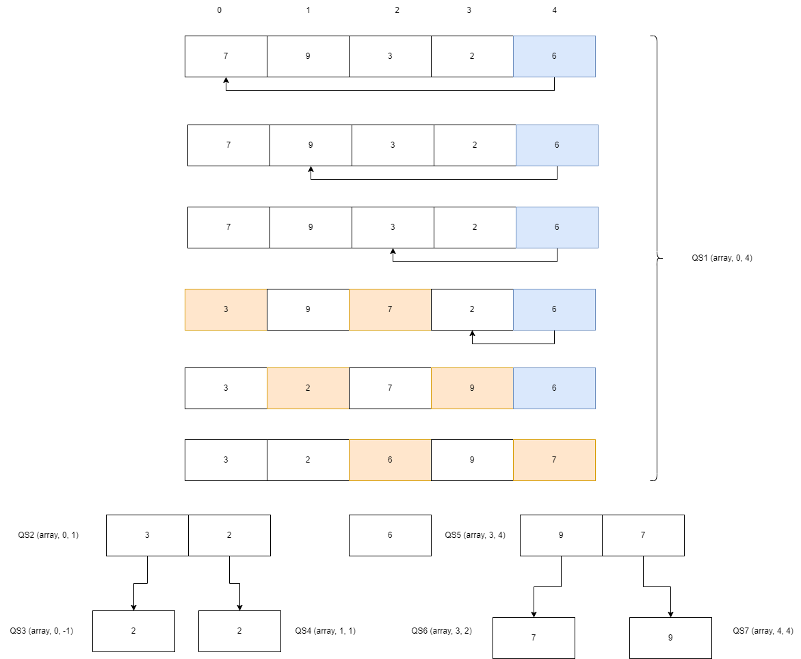

# QUICK SORT

Quicksort je algoritam sortiranja baziran na divide i conquer pristupu gdje se:

* Niz dijeli u podnizove birajući pivot element (element izabran iz niza).
* Prilikom dijeljenja niza, pivot element se pozicionira na način da se elementi manji od pivota čuvaju na lijevoj strani i elementi veći od pivota na desnoj strani od pivota.
* Lijevi i desni podniz se isto dijele koristeći isti pristup. Ovaj proces se nastavlja dok svaki podniz ne sadrži samo jedan element. U tom trenutku elementi su već sortirani.
* Na kraju elementi se kombiniraju da formiraju sortirani niz.

## Algoritam Quicksorta

Quicksort radi na principu in-place sorting algoritma (sortiranje se radi na ulaznom algoritmu - za razliku od merge sorta). Bazira se na odabir pivot elementa, a zavisno odakle se uzima pivot razlikujemo:
* prvi element kao pivot
* zadnji element kao pivot
* random element kao pivot

Pseudokod algoritma je sljedeći:

```
void quicksort(int array[], int start, int end){
    1. if(start<end)
    2.      partitionIndex = partition(arr, start, end)
    3.      quicksort(arr, start, partitionIndex-1)
    4.      quicksort(arr, partitionIndex+1, end)
    5. endif
}
```

Dakle, ova funkcija provjerava da li je početak manji od kraja (ako nije došlo se do jednog elementa).
Ako jest, onda se traži partitionIndex (indeks gdje će preći pivot element) i na osnovu njega se poziva quicksort rekurzivno nad elementima lijevo od pivota (koji je sad na partitionIndexu) i onda rekurzivno nad elementima desno od pivota.

Pseudokod partition funkcije je:

```
int partition(int arr[], int start, int end){
    1. pivot = arr[end]
    2. partitionIndex = start
    3. for(i = start to end)
    4.    if (arr[i]<=pivot)
    5.        swap(arr[i], arr[partitionIndex])
    6.        partitionIndex++
    7.    endif
    8. endfor
    9. swap(arr[e], arr[partitionIndex]) //arr[e] je pivot
    10. return partitionIndex
}
```
Dakle partition funkcija koja se zove unutar quicksort funkcije prvo uzima pivot element i postavlja partitionIndex na start. Sad se prolazi od početka do kraja niza i komparira se svaki element sa pivotom. Ako je taj element manji od pivota, onda se taj element mijenja sa elementom koji je na poziciji partitionIndexa i povećava se partitionIndex za 1. Na taj način se na početak dovedu svi elementi manji od pivota. Kad se to odradi sve, onda se pivot zamjeni sa elementom koji je u tom trenutku na poziciji partitionIndexa. Tada se partition index vrati i radi se rekurzivno ponovno poziv quicksorta za podnizove prije pivota i poslije pivota. 



## Kompleksnost Quicksorta

<table>
<thead>
<th>
Kompleksnost
</th>
<th>
Worst
</th>
<th>
Average
</th>
<th>
Best
</th>
</thead>
<tbody>
<tr>
<td>
Vremenska
</td>
<td>O(n2)</td>
<td>O(nlogn)</td>
<td>O(nlogn)</td>
<tr>
<td>
Prostorna
</td>
<td>O(logn)</td>
<td>O(logn)</td>
<td>O(logn)</td>
</tr>
</tr>
</tbody>
</table>

Najgori slučaj - Big(O) - O(n2) je kad se uzme pivot koji je najveći ili najmanji element.

Najbolji slučaj - Big(theta) - O(nlogn) je kada je pivot srednji element ili element blizu sredine.

Prosječni slučaj - Big(omega) - O(nlogn) je kada se prethodni uslovi ne poklope.

## Primjena Quicksorta

Quicksort algoritam se koristi kad je:

* programski jezik povoljan za rekurziju
* vremenska kompleksnost je važna
* prostorna kompleksnost je važna