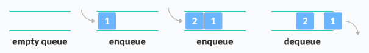
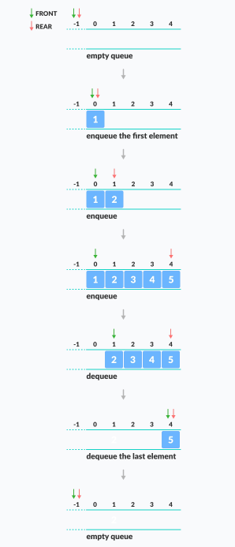

# QUEUE

Red je korisna struktura podataka. Analogija za ovu strukturu podataka je stvarni red (red za ulaznice), gdje osoba koja prva ulazi u red je i prva osoba koja dobija ticket.

Red prati FIFO princip (FIRST IN FIRST OUT).

Dodavanje elemenata u red se naziva ENQUEUE i uklanjanje elemenata se naziva DEQUEUE.

OSNOVNE OPERACIJE REDA:

* ENQUEUE - Dodaje element na kraj reda
* DEQUEUE - Uklanja element sa početka rada
* IsEmpty - Provjera je li red prazan
* IsFull - Provjera je li red pun
* PEEK - Daje vrijednost početka reda bez da ga uklanja

Red radi na sljedeći način:

* Dva pokazivača FRONT i REAR. Front prati prvi element reda, a REAR prati zadnji element reda. Inicijalno vrijednost FRONT i REAR je -1.

ENQUEUE se radi na sljedeći način: 
* Provjeri je li red pun. 
* Za prvi element postavi vrijednost FRONT-a na 0. 
* Povećaj REAR indeks za 1. 
* Dodaj novi element na poziciju koji pokazuje REAR.

DEQUEUE se radi na sljedeći način: 
* Provjeri je li red prazan. 
* Vrati vrijednost koju pokazuje FRONT. 
* Povećaj FRONT indeks za 1. 
* Za zadnji element resetuj vrijednosti FRONT-a i REAR-a na -1.

Kompleksnost reda:

Kompleksnost enqueue i queueu operacija koristeci nizove je O(1).

Primjena reda:

Koristi se za CPU scheduling, sinhronizaciju, Call centar sisteme itd.