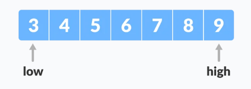
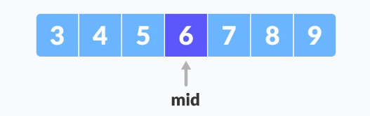
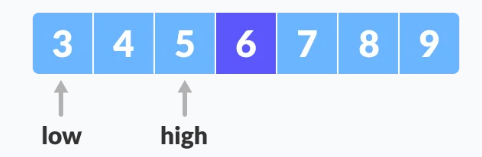
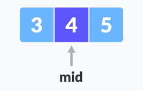
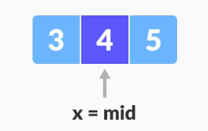

# BINARNA PRETRAGA

Binarna pretraga je algoritam pretrage za pronalazak pozicije elementa u sortiranom nizu.

U ovom pristupu, element se uvijek traži u srednjoj vrijednosti niza.

Binarna pretraga se može samo implementirati na sortiranom nizu. Ako elementi nisu sortirani, prvo se moraju sortirati.

Binarna pretraga se može implementirati na dva načina:

* iterativna metoda
* rekurzivna metoda

Generalni koraci za obje metode su:

1. Zadan je niz:


Neka se traži x=4.

2. Postavi dva pokazivača low i high na najmanju i najveću poziciju respektivno.



3. Pronađi srednji element niza arr[(low+high)/2]=6



4. Ako je x==mid vrati mid. Suprotno, kompariraj element koji se traži sa mid.
   
5. Ako je x>mid, kompariraj x sa srednjim elementom elemenata na desnoj strani od mid-a. To se radi tako što se postavi low na low = mid+1.

6. Suprotno, kompariraj x sa srednjim elementom elemenata na lijevoj strani od mid-a. To se radi tako što se hig postavi na high=mid-1.



7. Ponavljaj korake 3-6 dok high ne postane low.
   


8. x=4 je pronađen



## Algoritam

Iteracijska metoda:

```
do until the pointers low and high meet each other.
    mid = (low + high)/2
    if (x == arr[mid])
        return mid
    else if (x > arr[mid]) // x is on the right side
        low = mid + 1
    else                       // x is on the left side
        high = mid - 1
```

Rekurzivna metoda:

```
binarySearch(arr, x, low, high)
    if low > high
        return False 
    else
        mid = (low + high) / 2 
        if x == arr[mid]
            return mid
        else if x > arr[mid]        // x is on the right side
            return binarySearch(arr, x, mid + 1, high)
        else                               // x is on the left side
            return binarySearch(arr, x, low, mid - 1)
```

## Kompleksnost Selection sorta

<table>
<th>
Kompleksnost
</th>
<th>
Best
</th>
<th>
Worst
</th>
<th>
Average
</th>
<tbody>
<tr>
<td>
Vremenska kompleksnost
</td>
<td>
O(1)
</td>
<td>
O(log n)
</td>
<td>
O(log n)
</td>
</tr>
<tr>
<td>
Prostorna kompleksnost
</td>
<td>
O(1)
</td>
<td>
O(1)
</td>
<td>
O(1)
</td>
</tr>
</tbody>
</table>

## Primjena binarne pretrage

U bibliotekama od Jave, .NET, C++ STL

Prilikom debugiranja, binarna pretraga se koristi da označi mjesto gdje se desila greška.
