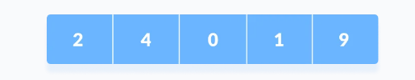
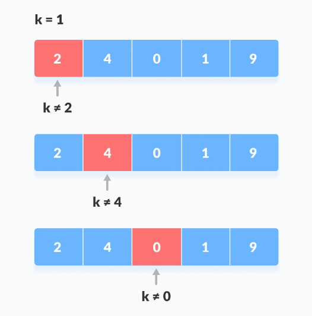
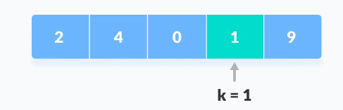

# LINEARNA PRETRAGA

Linearna pretraga je sekvencijalni algoritam pretrage gdje startamo od jednog kraja i provjeravamo svaki element liste, sve dok se ne nađe željeni element. To je najjednostavniji algoritam pretrage.



Zamislimo da tražimo element 1.



Startamo od prvog elementa i kompariramo k sa svakim elementom x.



Ako je x==k vrati indeks tog elementa, suprotno element nije nađen.

## Algoritam

```
LinearSearch(array, key)
  for each item in the array
    if item == value
      return its index
```

## Kompleksnost linearne pretrage

Vremenska kompleksnost: O(n)

Prostorna kompleksnost: O(1)

## Primjena linearne pretrage

Za pretragu manjih nizova (< 100 elemenata).