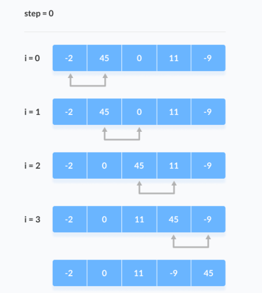
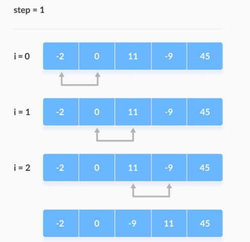
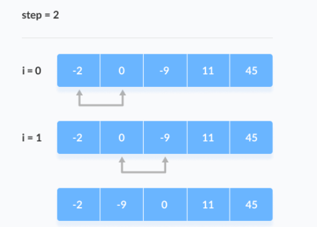
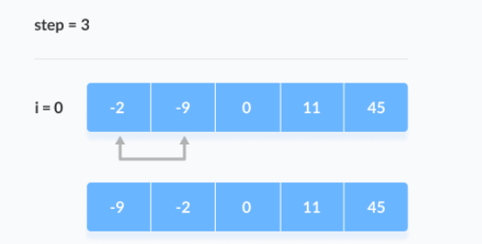

# Bubble Sort

Buuble sort je sortirajući algoritam koji komparira dva susjedna elementa i mijenja ih sve dok nisu u odgovarajućem redu.

Dobio je ime po kretanju mjehurića zraka u vodi koji se podižu do površine, svaki element u nizu se pomjera do kraja u svakoj iteraciji.

Primjer 1.

Sortiramo elemente u rastućem redu (Ascending-ASC).

1. Prva iteracija (Kompariraj i zamjeni)

Krećemo od prvog indeksa. Kompariramo prvi i drugi element. Ako je prvi element veći od drugog elementa, oni se mijenjaju. Sad kompariramo drugi i treći element i mijenjamo ih ako nisu u redu. Taj proces se ponavlja do zadnjeg elementa.



2. Preostale iteracije (Kompariraj i zamjeni)

Isti proces se ponavlja i za ostale iteracije. Poslije svake iteracije, najveći element između nesortiranih elemenata se smješta na kraj.



U svakoj iteraciji, komparacija uzima mjesto do zadnjeg nesortiranog elementa.



Niz je sortiran kad su svi nesoritrani elementi smješteni na odgovarajuće pozicije.



## Algoritam

```
bubbleSort(array)
  for i <- 1 to indexOfLastUnsortedElement-1
    if leftElement > rightElement
      swap leftElement and rightElement
end bubbleSort
```

## Optimizirani Bubble Sort Algoritam

U prethodnom algoritmu, komparacije se rade iako je algoritam već sortiran. 

To povećava vrijeme izvršavanja. Da bi to riješili uvodimo dodatnu varijablu naziva ```swapped```. Vrijednost ove varijable se postavi na true ako se desi promjena zamjene elementa. Suprotno postavi se na false.

Poslije iteracije, ako nije bilo zamjena, vrijednost varijable swapped će biti false. To znači da su elementi već sortirani i nema potrebe za daljnim iteracijama. To će smanjiti vrijeme izvršavanja i pomoći optimizaciji bubble sort-a.

```
bubbleSort(array)
  swapped <- false
  for i <- 1 to indexOfLastUnsortedElement-1
    if leftElement > rightElement
      swap leftElement and rightElement
      swapped <- true
end bubbleSort
```

## Kompleksnost Bubble Sort-a

Vremenska kompleksnost:

Najbolji slučaj: O(n) - vec sortiran niz
Najgori slučaj: O(n^2) - ako zelimo ASC a niz je DESC ili obrnuto
Prosječni slučaj: O(n^2) - ako elementi nisu ni ASC ni DESC ali su razbacani

Prostorna kompleksnost 

O(1) - koristi se dodatna varijabla za swap, dok se kod optimiziranog algoritma koriste dvije dodatne varijable pa je prostorna kompleksnost O(2)

<table>
<th>
Krug
</th>
<th>
Broj komparacija
</th>
<tr>
<td>
1
</td>
<td>
n-1
</td>
<tr>
<tr>
<td>
2
</td>
<td>
n-2
</td>
<tr>
<tr>
<td>
...
</td>
<td>
...
</td>
</tr>
<tr>
<td>
zadnji
</td>
<td>
1
</td>
</tr>
</table>

(n-1)+(n-2)+...+1 = n(n-1)/2 = n^2

Isto tako bubble sort zahtjeva dvije petlje, pa nam i to kaže da je kompleksnost n*n=n^2.

Primjena:

kompleksnost nije bitna

potreban je kratak i jasan kod