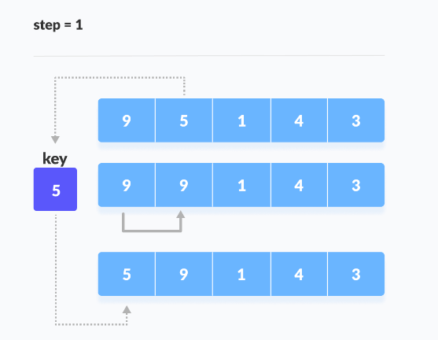
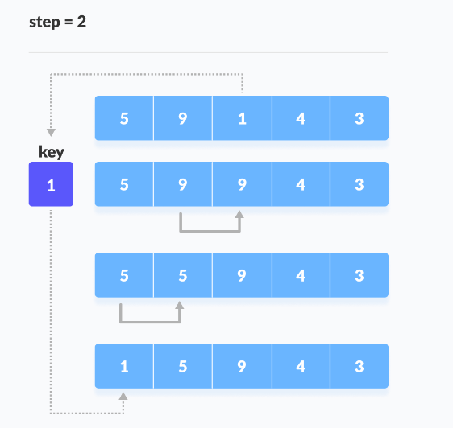
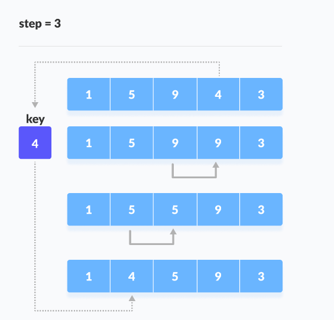
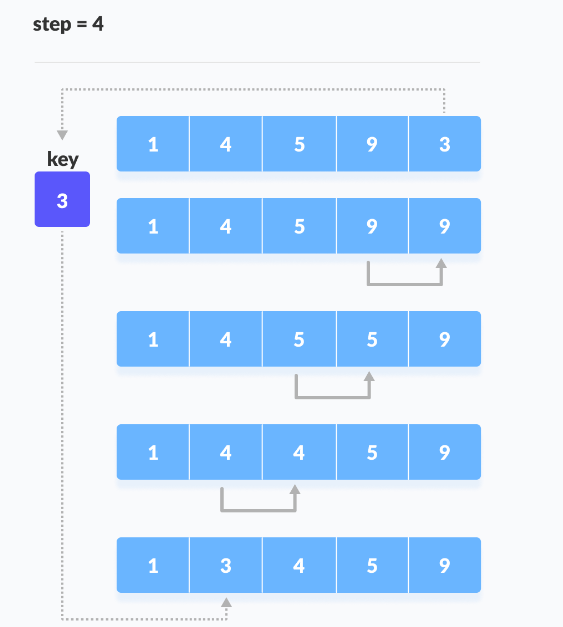

# INSERTION SORT

Insertion sort je algoritam za sortiranje koji smješta nesortirane elemente na njihovo odgovarajuće mjesto u svakoj iteraciji.

Insertion sort radi slično kao kad sortiramo karte u našoj ruci u kartaškoj igri.

Pretpostavimo da je prva karta već sortirana, onda uzmemo nesortiranu kartu. Ako je ona veća onda je smještamo na desnu stranu, suprotno na lijevu stranu. Na isti način, ostale nesortirane karte se uzimaju i smještaju se na pravo mjesto.


Zamislimo da imamo sljedeći niz:


Pretpostavi se da je prvi element u nizu sortiran. Uzme se drugi element i spremi se odvojeno u ključ.

Uporedi se ključ sa prvim elementom. Ako je prvi element veći od ključa onda se ključ stavlja ispred prvog elementa.



Sad uzmemo treći element i uporedimo ga sa elementima sa lijeva. Stavimo ga poslije elementa manjeg od njega. Ako nema manjih postavimo ga na početak.



Na isti način postavljamo i preostale elemente.




## ALGORITAM

```
insertionSort(array)
  mark first element as sorted
  for each unsorted element X
    'extract' the element X
    for j <- lastSortedIndex down to 0
      if current element j > X
        move sorted element to the right by 1
    break loop and insert X here
end insertionSort
```

## KOMPLEKSNOST INSERTION SORTA

<table>
<th>
Best
</th>
<th>
Worst
</th>
<th>
Average
</th>
<tbody>
<td>
Vremenska kompleksnost
</td>
<td>
O(n)
</td>
<td>
O(n2)
</td>
<td>
O(n2)
</td>
<td>
Prostorna kompleksnost
</td>
<td>
O(1)
</td>
<td>
O(1)
</td>
<td>
O(1)
</td>
</tbody>
</table>

Najgori slučaj je O(n2) - ako je red u ASC, a želimo sortirati u DESC.

Svaki element se mora provjeriti sa svakim od drugih elemenata, tj. za svaki n-ti elementi (n-1) komparacija se radi.

Odnosno ukupni broj komparacija je n*(n-1) što je približno n2.

Najbolji slučaj je O(n) - ako je niz već sortiran, vanjska petlja se pokreće samo za n broj puta, dok se unutarnja petlja ne pokreće nikako. Kompleksnost je dakle linearna.

Prosječni slučaj je O(n) - javlja se kad su elementi random poredani, niti DESC niti ASC.

Prostorna kompleksnost je O(1) jer se koristi dodatna varijabla "ključ".

## Primjena

Insertion sort se koristi kada:

* niz ima manji broj elemenata

* ostao je samo manji broj elemenata za sort.


