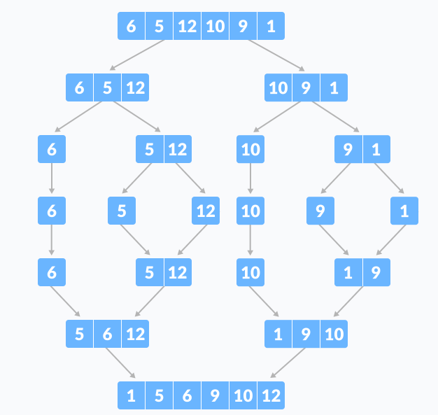
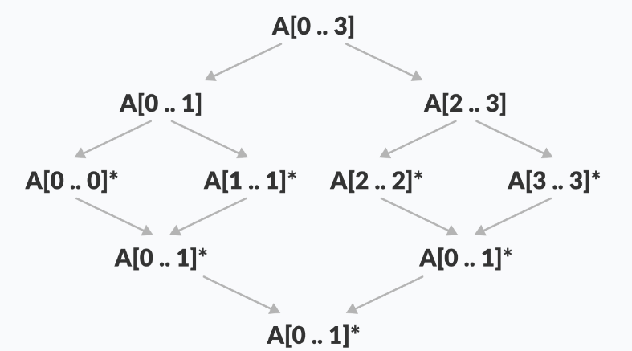
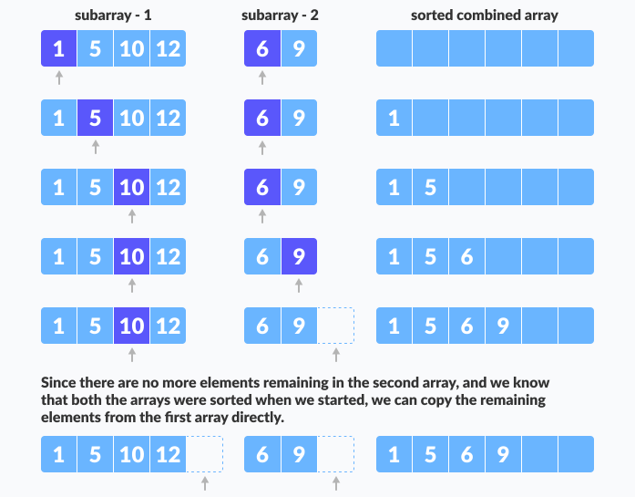

# MERGE SORT

Merge sort je jedan od najpopularnijih sorting algoritama baziran na principu Podjeli pa vladaj.

Problem se dijeli na više podproblema. Svaki podproblem se riješava individualno. Na kraju, podproblemi se kombiniraju u finalno rješenje.



Podjeli pa vladaj strategija:

Koristeći podjeli pa vladaj tehniku, probleme dijelimo u podprobleme. Kada se pronađe rješenje za svaki podproblem, kombiniramo rezultat iz podproblema i formiramo finalno rješenje.

Zamislimo da trebamo sortirati niz A. Podproblem bi bio da sortiramo sekciju ovog niza startajući od indeksa p i završavajući na indeksu r, označavajući to kao A[p...r].

Podjeli:

Ako je q, tačka na pola između p i r, onda možemo podijeliti podniz A[p...r] u dva niza A[p...q] i A[q+1...r].

Osvoji:

U conquer koraku, mi sortiramo oba podniza A[p...q] i A[q+1...r]. Ako još nismo došli do baznog slučaja, ponovno dijelimo i ove podnizove i pokušavamo ih sortirati.

Kombiniraj:

Kad conquer korak dođe do baznog koraka i dobijemo dva sortirana podniza A[p...q] i A[q+1...r] za niz A[p...r], kombiniramo rezultate kreirajući sortirani niz A[p...r] od dva podniza A[p...q] i A[q+1...r].

## Merge Sort Algoritam

MergeSort funkcija kontinuirano dijeli niz u dvije pole dok ne dođe do faze gdje pokušavamo odraditi MergeSort na podnizu veličine 1.

Poslije toga, merge funkcija kombinira sortirane nizove u veće nizove dok se cijeli niz ne merga.

```
MergeSort(A, p, r):
    if p > r 
        return
    q = (p+r)/2
    mergeSort(A, p, q)
    mergeSort(A, q+1, r)
    merge(A, p, q, r)
```

Da bi sortirali cijeli niz, moramo pozivati MergeSort(A, 0, length(A)-1).



Kao što se vidi na slici, merge sort algoritam rekurzivno dijeli algoritam na polovice dok ne dođe do baznog slučaja niza sa 1 elementom. Poslije toga, merge funkcija kupi sortirane podnizove i spaja ih i formira sortiran cijeli niz.

## Merge korak Merge Sorta

Svaki rekurzivni algoritam je zavisan od baznog slučaja i mogućnosti da kombinira rezultate od baznog slučaja. Najvažniji korak merge sorta je merge.

Merge korak je rješenje jednostavnog problema merga dvije sortirane liste/niza da bi se napravila jedna velika sortirana lista/niz.

Algoritam održava tri pokazivača, jedan za svaki niz i jedan za održavanje trenutnog indeksa finalnog sortiranog niza.




Writing the Code for Merge Algorithm
A noticeable difference between the merging step we described above and the one we use for merge sort is that we only perform the merge function on consecutive sub-arrays.

This is why we only need the array, the first position, the last index of the first subarray(we can calculate the first index of the second subarray) and the last index of the second subarray.

Our task is to merge two subarrays A[p..q] and A[q+1..r] to create a sorted array A[p..r]. So the inputs to the function are A, p, q and r

The merge function works as follows:

Create copies of the subarrays L <- A[p..q] and M <- A[q+1..r].
Create three pointers i, j and k
i maintains current index of L, starting at 1
j maintains current index of M, starting at 1
k maintains the current index of A[p..q], starting at p.
Until we reach the end of either L or M, pick the larger among the elements from L and M and place them in the correct position at A[p..q]
When we run out of elements in either L or M, pick up the remaining elements and put in A[p..q]
In code, this would look like:

// Merge two subarrays L and M into arr
void merge(int arr[], int p, int q, int r) {

    // Create L ← A[p..q] and M ← A[q+1..r]
    int n1 = q - p + 1;
    int n2 = r - q;

    int L[n1], M[n2];

    for (int i = 0; i < n1; i++)
        L[i] = arr[p + i];
    for (int j = 0; j < n2; j++)
        M[j] = arr[q + 1 + j];

    // Maintain current index of sub-arrays and main array
    int i, j, k;
    i = 0;
    j = 0;
    k = p;

    // Until we reach either end of either L or M, pick larger among
    // elements L and M and place them in the correct position at A[p..r]
    while (i < n1 && j < n2) {
        if (L[i] <= M[j]) {
            arr[k] = L[i];
            i++;
        } else {
            arr[k] = M[j];
            j++;
        }
        k++;
    }

    // When we run out of elements in either L or M,
    // pick up the remaining elements and put in A[p..r]
    while (i < n1) {
        arr[k] = L[i];
        i++;
        k++;
    }

    while (j < n2) {
        arr[k] = M[j];
        j++;
        k++;
    }
}
Merge( ) Function Explained Step-By-Step
A lot is happening in this function, so let's take an example to see how this would work.

As usual, a picture speaks a thousand words.

Merging two consecutive subarrays of array
Merging two consecutive subarrays of array
The array A[0..5] contains two sorted subarrays A[0..3] and A[4..5]. Let us see how the merge function will merge the two arrays.

void merge(int arr[], int p, int q, int r) {
// Here, p = 0, q = 4, r = 6 (size of array)
Step 1: Create duplicate copies of sub-arrays to be sorted
    // Create L ← A[p..q] and M ← A[q+1..r]
    int n1 = q - p + 1 = 3 - 0 + 1 = 4;
    int n2 = r - q = 5 - 3 = 2;

    int L[4], M[2];

    for (int i = 0; i < 4; i++)
        L[i] = arr[p + i];
        // L[0,1,2,3] = A[0,1,2,3] = [1,5,10,12]

    for (int j = 0; j < 2; j++)
        M[j] = arr[q + 1 + j];
        // M[0,1] = A[4,5] = [6,9]
Create copies of subarrays for merging
Create copies of subarrays for merging
Step 2: Maintain current index of sub-arrays and main array
    
    int i, j, k;
    i = 0; 
    j = 0; 
    k = p; 
Maintain indices of copies of sub array and main array
Maintain indices of copies of sub array and main array
Step 3: Until we reach the end of either L or M, pick larger among elements L and M and place them in the correct position at A[p..r]
    while (i < n1 && j < n2) { 
        if (L[i] <= M[j]) { 
            arr[k] = L[i]; i++; 
        } 
        else { 
            arr[k] = M[j]; 
            j++; 
        } 
        k++; 
    }
Comparing individual elements of sorted subarrays until we reach end of one
Comparing individual elements of sorted subarrays until we reach end of one
Step 4: When we run out of elements in either L or M, pick up the remaining elements and put in A[p..r]
    // We exited the earlier loop because j < n2 doesn't hold
    while (i < n1)
    {
        arr[k] = L[i];
        i++;
        k++;
    }
Copy the remaining elements from the first array to main subarray
Copy the remaining elements from the first array to main subarray
    // We exited the earlier loop because i < n1 doesn't hold  
    while (j < n2)
    {
        arr[k] = M[j];
        j++;
        k++;
    }
}
Copy remaining elements of second array to main subarray
Copy remaining elements of second array to main subarray
This step would have been needed if the size of M was greater than L.

At the end of the merge function, the subarray A[p..r] is sorted.


## KOMPLEKSNOST MERGE SORTA

<table>
<th>
Best
</th>
<th>
Worst
</th>
<th>
Average
</th>
<tbody>
<td>
Vremenska kompleksnost
</td>
<td>
O(n*log n)
</td>
<td>
O(n*log n)
</td>
<td>
O(n*log n)
</td>
<td>
Prostorna kompleksnost
</td>
<td>
O(n)
</td>
<td>
O(n)
</td>
<td>
O(n)
</td>
</tbody>
</table>

## Primjena

Insertion sort se koristi kada:

* Inverzijski count

* Eksterno sortiranje
  
* Ecommerce aplikacije
