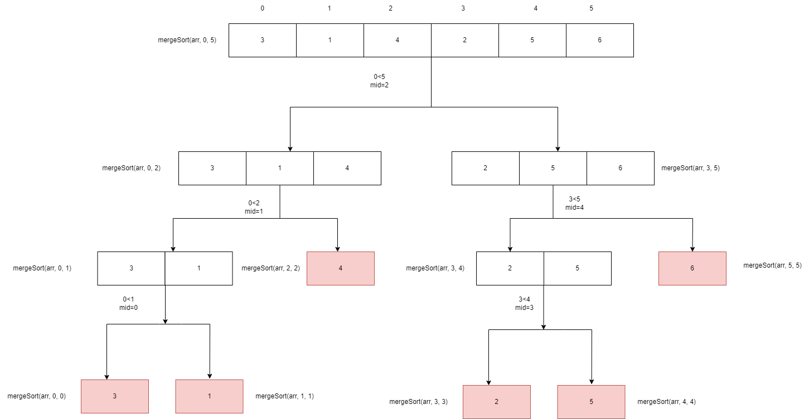
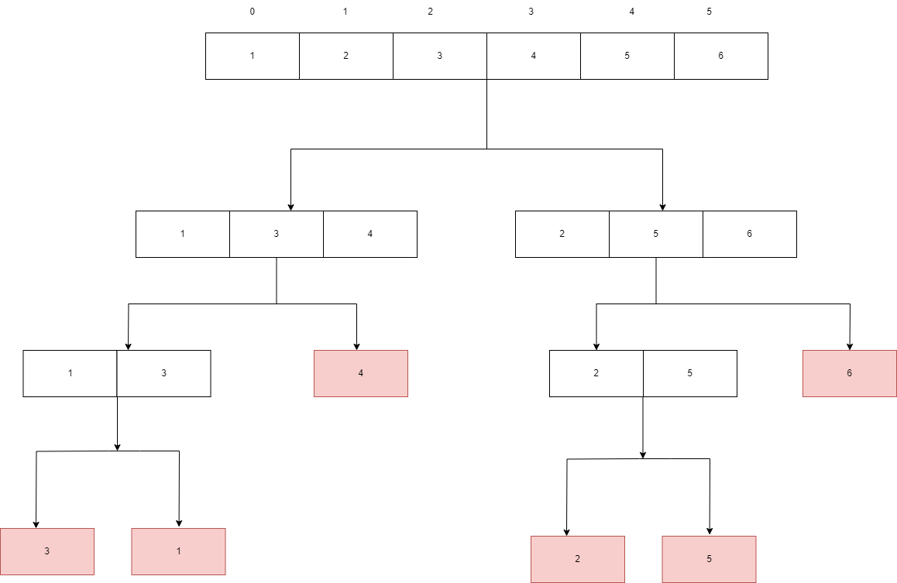

# MERGE SORT

Merge sort je jedan od najpopularnijih sorting algoritama baziran na principu Podjeli pa vladaj.

Problem se dijeli na više podproblema. Svaki podproblem se riješava individualno. Na kraju, podproblemi se kombiniraju u finalno rješenje.


## Merge Sort funkcija

U ovoj funkciji dešava se dijeljenje ulaznog niza na podnizove sve dok se ne dođe do baznog slučaja (tj. do jednog elementa).

```
mergeSort(int arr[], int left, int right){
    if left<right
    1. mid = (left+right)/2
    2. mergeSort(arr, left, mid)
    3. mergeSort(arr, mid+1, right)
    4. merge(arr, left, mid, right)
}
```

Recimo da imamo zadan niz:

3, 1, 4, 2, 5, 6

Sljedeća slika ilustruje rekurzivne pozive mergeSort algoritma:



## Merge funkcija

U ovoj funkciji dešava se merge/spajanje podijeljenih podnizova. To je poziv funkcije u prethodnom algoritmu pod korakom 4. Vidimo da se on poziva tek kad više nema mogućnosti dijeljenja sa korakom 2 i 3. Tad se poziva ta funkcija koja spaja i sortira elemente.

```
merge(int arr[], int left, int mid, int right){
    1. i = left; j = mid+1; k = left;
    2. temp[size];
    3. while(i<=mid && j<=right)
    3.1.  if(arr[i]<arr[j])
    3.1.1.  temp[k]=arr[i]; i++; k++;
    3.2.  else
    3.2.1.  temp[k]=arr[j];j++;k++
    4. while(i<=mid)
    4.1.    temp[k]=arr[i]; i++;k++;
    5. while(j<=right)
    5.1.    temp[k]=arr[j]; j++;k++;
    6. for(int p=left;p<right;p++)
    6.1.    arr[p] = temp[p]
}
```

Cijeli proces merge sorta kreće sa odvijanjem kad se dođe do baznog koraka u toj iteraciji.

Koriste se tri "pokazivača" za praćenje pozicija u podnizovima. Pokazivač i se postavi na vrijednost left (da prati lijevi podniz), j se postavi na vrijednost mid+1 kako bi pratio desni podniz (mid+1 je početak desnog podniza koji ide do right). Pokazivač k služi za privremeni niz u kojeg ćemo spremati sortirane vrijednosti. Taj niz se deklarira u koraju dva kao temp[size].

Dalje, sve dok je i<=mid (dok se ne potroše elementi lijevog podniza) i dok se ne potroše elementi desnog podniza j<=right kompariraj da li je prvi element lijevog podniza manji od prvog elementa desnog podniza. Ako jest postavi na prvi indeks privremenog niza arr[i], povećaj i za jedan i k za jedan. Ako nije veći onda se postavi na prvi indeks privrenog niza arr[j], poveća se j za jedan i k za jedan. Ta provjera se radi dok se ne potroše elementi jednog niza.

Druge dvije while petlje služe da se elementi koji su ostali od niza koji nije potrošen samo poredaju u ostatak privremenog niza.

Na kraju se to sve poreda u pravi niz arr[].



## KOMPLEKSNOST MERGE SORTA

<table>
<th>
Kompleksnost
</th>
<th>
Best
</th>
<th>
Worst
</th>
<th>
Average
</th>
<tbody>
<tr>
<td>
Vremenska kompleksnost
</td>
<td>
O(n*log n)
</td>
<td>
O(n*log n)
</td>
<td>
O(n*log n)
</td>
<td>
</tr>
<tr>
<td>
Prostorna kompleksnost
</td>
<td>
O(n)
</td>
<td>
O(n)
</td>
<td>
O(n)
</td>
</tr>
</tbody>
</table>

## Primjena

Insertion sort se koristi kada:

* Inverzijski count

* Eksterno sortiranje
  
* Ecommerce aplikacije
