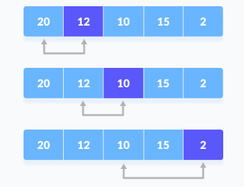
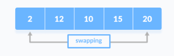
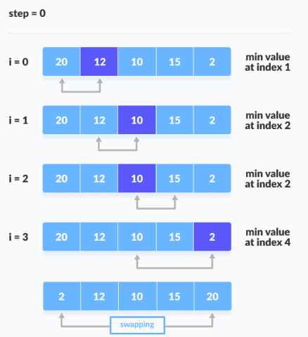
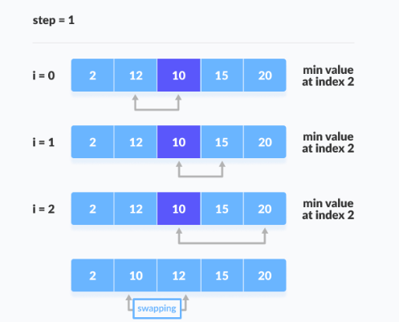
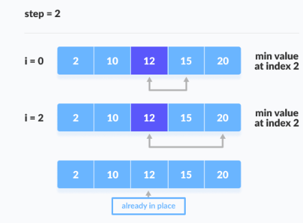
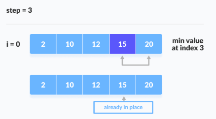

# SELECTION SORT

Selection sort je algoritam sortiranja koji uzima najmanji element iz nesortirane liste u svakoj iteraciji i smješta taj element na početak nesortirane liste.


Princip rada selection sort algoritma:



Selection sort uzima prvi element i postavlja ga kao minimum. Zatim komparira taj minimum sa sljedećim elementom. Ako je sljedeći element manji od minimuma dodijeli se da je sljedeći element minimum. I tako sve do zadnjeg elementa.

Poslije svake iteracije minimum se stavlja na početak.



Odnosno zamijeni se prvi sa minimumom.

Dalje za narednu iteraciju, indeksiranje počinje od prvo nesortiranog elementa. Koraci 1 i 3 se ponavljaju dok se svi elementi na postave na odgovarajuće pozicije.






## Selection Sort Algoritam

```
selectionSort(array, size)
  repeat (size - 1) times
  set the first unsorted element as the minimum
  for each of the unsorted elements
    if element < currentMinimum
      set element as new minimum
  swap minimum with first unsorted position
end selectionSort
```

## Kompleksnost Selection sorta

<table>
<th>
Best
</th>
<th>
Worst
</th>
<th>
Average
</th>
<tbody>
<td>
Vremenska kompleksnost
</td>
<td>
O(n2)
</td>
<td>
O(n2)
</td>
<td>
O(n2)
</td>
<td>
Prostorna kompleksnost
</td>
<td>
O(1)
</td>
<td>
O(1)
</td>
<td>
O(1)
</td>
</tbody>
</table>

Broj komparacija:

1 - (n-1)

3 - (n-2)

2 - (n-3)

...

n - 1

(n-1)+(n-2)+...+1=n(n-1)/2 = n2

O(n2)

ili na osnovu petlji kojih su 2, a to je n*n=n2.

Ako hoćemo u ASC redu, a niz je u DESC javlja se najgori slučaj.

Prosječni slučaj O(n2) se javlja kad su elementi raspoređeni ni ASC ni DESC.

Najbolji slučaj O(n2) kad je niz već sortiran.

Svaki slučaj je isti jer svaki put mora provjeravati minimum.

Prostorna kompleksnost je O(1) jer se koristi temp dodatna varijabla.

## Primjena

Koristi se za:

* mali popis treba sortirati
* trošak zamjene nije bitan
* provjera svih elemenata je obavezna
* trošak pisanja u memoriju je važan kao u flash memoriji (broj pisanja/zamjena je  (n) u usporedbi s O(n2) Bubble sorte)


