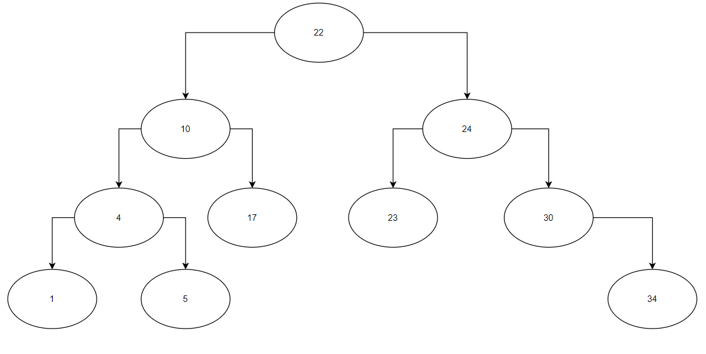

# PRVI KOLOKVIJ IZ PREDMETA ALGORITMI I STRUKTURE PODATAKA

## VREMENSKA I PROSTORNA SLOŽENOST ALGORITMA – 10b
1.	Objasniti šta radi sljedeći pseudokôd:

```
Korak 1: Start
Korak 2: Deklariraj varijable n, i i flag
Korak 3: Inicijaliziraj varijable, flag<-1, i<-2
Korak 4: Pročitaj n od korisnika
Korak 5: Ponavljaj korake do i=(n/2)
    Korak 5.1: If (n%i) jednako nula
                flag <-0
                Idi na korak 6
    Korak 5.2: i<-i+1
Korak 6: If flag = 0
            Prikaži: n nije prost
         Else
            Prikaži: n je prost
Korak 7: Stop
```

Implementirati prikazani pseudokôd koristeći C++. Analizirati vremensku i prostornu složenost algoritma (napisati koja je, zašto je takva  i objasniti šta nam to znači).

Napomena: Implementacija u C++5b, Vremenska i prostorna složenost i objašnjenje 5b

RED – 25 bodova

2.	Implementirati program koji korisniku omogućuje odabir opcija iz sljedećeg menija:
```	
# MENI
1.	DODAJ ELEMENT U RED (ENQUEUE)
2.	UKLONI ELEMENT IZ REDA (DEQUEUE) 
3.	ISPIS REDA
UNESITE -1 ZA IZLAZAK IZ MENIJA
```
Napomena: Prikaz menija iznosi 5b, struktura reda i inicijalizacija reda 5b, Opcije redom nose 5, 5, 5.

LISTE – 30 bodova

3.	Implementirati jednostruko povezanu listu kroz sljedeći meni:
```
#MENI
1.	DODAJ ELEMENT NA KRAJ LISTE
2.	DODAJ ELEMENT NA POZICIJU
3.	OBRISI ELEMENT SA POCETKA LISTE
4.	ISPISI LISTU
5.	PRETRAZI CVOR
UNESITE -1 ZA IZLAZAK IZ MENIJA
```
    
Napomena: Prikaz menija iznosi 5b, struktura i inicijalizacija liste 3b, Opcije redom nose 5, 5, 2, 5, 5 

STABLO – 35 bodova

4.	Implementirati binarno stablo pretrage kao na slici 1. Program mora sadržavati sljedeće funkcije:
```
Node *createNode(int value);
Node *insert(Node *root, int key);
void inorder(Node *root);
bool search(Node *root, int key);
```
Struktura čvora stabla je sljedeća:
```
struct Node{
	int vrijednost;
	Node *left;
	Node *right;
};
```

Nakon uspješnog kreiranja stabla, korisnik unosi ključ i poziva funkciju search. Ako se ključ nalazi u stablu ispisuje se poruka: „Kljuc se nalazi u stablu.“, suprotno se ispisuje: „Kljuc se ne nalazi u stablu“.

  
Slika 1. Binarno stablo pretrage

Napomena: Insert i inorder 20b, Search 15b
