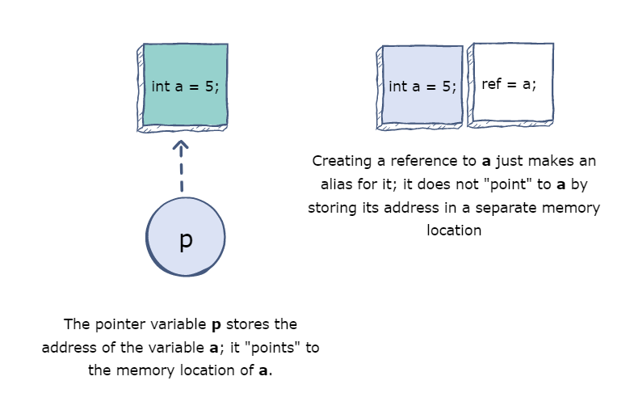

# STRUKTURE

Strukture su način grupiranja povezanih varijabli u jedno mjesto. Svaka varijabla u strukturi se zove član strukture. Za razliku od niza, strukture mogu imati razne tipove podataka (int, string, bool, itd).

Da bi napravili strukturu koristimo ključnu riječ ```struct``` i deklariramo sve članove unutar vitičastih zagrada. Nakon deklaracije preciziramo ime strukture:

```c++
struct{ // Deklaracija strukture
    int id; // Član
    string ime; // Član
} mojaStruktura; // Varijabla strukture/naziv strukture
```
Da bi pristupili članovima strukture koristimo sintaksu sa tačkom ```.```.

```c++
struct {
    int id;
    string ime;
} mojaStruktura;

mojaStruktura.id = 1;
mojaStruktura.ime = "Zinaid";

cout<<mojaStruktura.id<< "\n";
cout<<mojaStuktura.ime<< "\n";
```

Jednoj strukturi možemo dodijeliti više varijabli.

```c++
// Kreiraj strukturu
struct {
    string brend;
    string naziv;
} auto1, auto2;
```

Kad dodijelimo ime strukturi, možemo je koristiti kao tip podataka i u kodu nekim varijablama davati pripadnost tom tipu. To su takozvane Imenovane strukture.

```c++
struct Osoba {
    int id;
    string ime;
};

Osoba ucitelj;
Osoba ucenik;
```

Primjer 1. Napraviti strukturu Osoba koja ima ime, prezime i broj godina. Zatim kreirati dvije osobe koje pripadaju toj strukturi, provjeriti koja osoba je starija i ispisati njihovo puno ime i prezime.

Primjer 2. Napraviti strukturu Student, zatim unijeti broj studenata i informacije o tim studentima i ispisati studenta sa najvećim prosjekom.

```c++
struct Student{
    char ime[15], prezime[15];
    int godine;
    float prosjek;
}
```
# REFERENCE

Referenca (varijabla) je "referenca" na postojeću varijablu i kreira se sa & operatorom.

```c++
string hrana = "Burek"; // varijabla hrana
string &obrok = hrana; // referenca na varijablu
```

Sada možemo i varijablu hrana, kao i referencu obrok koristiti ako se odnosimo na varijablu hrana.
```c++
cout<<hrana<<endl; // daje Burek
cout<<obrok<<endl; // daje Burek
```

U prethodnim primjerima operator & je korišten za kreiranje reference, ali on se isto tako može koristiti za dobijanje memorijske adrese varijable (lokacije u memoriji kompjutera gdje je varijabla spremljena).

Kad se varijabla napravi u C++ dodijeli joj se memorijska adresa. Kad se doda vrijednost varijabli tada se ta vrijednost spremi na ovoj memorijskoj adresi. 

Da bi pristupili toj memorijskoj adresi koristimo operator &.

```c++
string hrana = "Burek";
cout<<&hrana; // Ispise 0x***
```

Reference i pokazivači ističu C++ od drugih jezika zbog toga što omogućuju manipulaciju podacima u kompjuterskoj memoriji - poboljšavaju brzinu i smanjuju kod.

# POKAZIVAČI

Pokazivač je varijabla koja čuva memorijsku adresu i njenu varijablu. Pokazivač pokazuje na tip podataka (npr. int) istog tipa i kreira se sa operatorom $*$.

Memorijska adresa varijable sa kojom radimo je dodijeljena pokazivaču.

```c++
string hrana = "Burek";
string* ptr = &hrana; // Pokazivač varijabla naziva ptr koja pokazuje na adresu varijable hrana

cout<<hrana<<endl; // Ispisuje Burek
cout<<&hrana<<endl; // Ispisuje memorijsku adresu varijable hrana (0x***)

// Ispis memorijske adrese varijable hrana preko pokazivača
cout<<ptr<<endl;

```

### Dereferenciranje:

Dereferenciranje predstavljadobijanje i vrijednosti kao i memorijske adrese putem pokazivača.

```c++
string hrana = "Burek";
string* ptr = &hrana;

// Ispis memorijske adrese varijable hrana sa pokazivacem
cout<<ptr<<endl; // 0x***

// Ispis vrijednosti varijable hrana sa pokazivacem - Dereferenciranje
cout<<*ptr<<endl; // Burek
```
Dakle, asterisk znak * se koristi u dva slučaja:
1. U deklaraciji (string* ptr) kreira pokazivač na varijablu
2. Kad se ne koristi u deklaraciji daje nam vrijednost varijable na koju pokazivač pokazuje
   
Promjena vrijednosti pokazivača znači da će promjeniti i vrijednost originalne varijable.

```c++
string hrana = "Burek";
string* ptr = &hrana;

*ptr = "Sirnica";

cout<<*ptr<<endl; // Sirnica
cout<<hrana<<endl; // Sirnica
```

## REFERENCE VS POKAZIVAČI

Pokazivač je varijabla koja pokazuje na memorijsku adresu druge varijable. Referenca je alias za već postojeću varijablu. Kad se referenca veže za jednu varijablu, ne može se promjeniti da referira na drugu varijablu.

<div style="text-align:center"></div>

<table>
<tr>
<th>Reference</th>
<th>Pokazivači</th>
</tr>
<tr>
<td>Mora se inicijalizirati kad se deklarira</td>
<td>Ne mora se inicijalizirati kad se deklarira</td>
</tr>
<tr>
<td>Ne može biti NULL</td>
<td>Može biti NULL</td>
</tr>
<tr>
<td>Ne mora se dereferencirati sa &</td>
<td>Mora se dereferencirati sa &</td>
</tr>
<tr>
<td>Ne možemo reinicijalizirati referencu da referencira na drugu varijablu.</td>
<td>Možemo reinicijalizirati pokazivač da pokazuje na drugu varijablu.</td>
</tr>
</table>

NULL pokazivač inicijaliziramo ako u tom trenutku, ne znamo na koju varijablu će naš pokazivač pokazivati, inače bi imali tkzv. Wild pointer.

Pokazivač možemo inicijalizirati i kao void tip, tako da ga kasnije možemo dodijeliti bilo kojem drugom tipu.

Literatura:

https://www.freecodecamp.org/news/pointers-in-c-are-not-as-difficult-as-you-think/

https://www.geeksforgeeks.org/references-in-c/