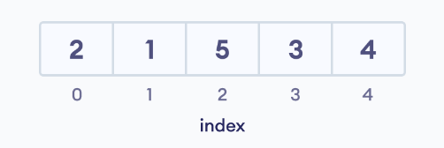
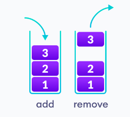
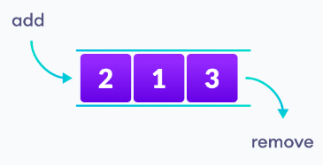
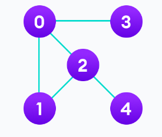
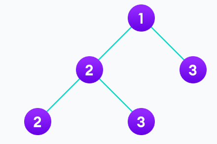
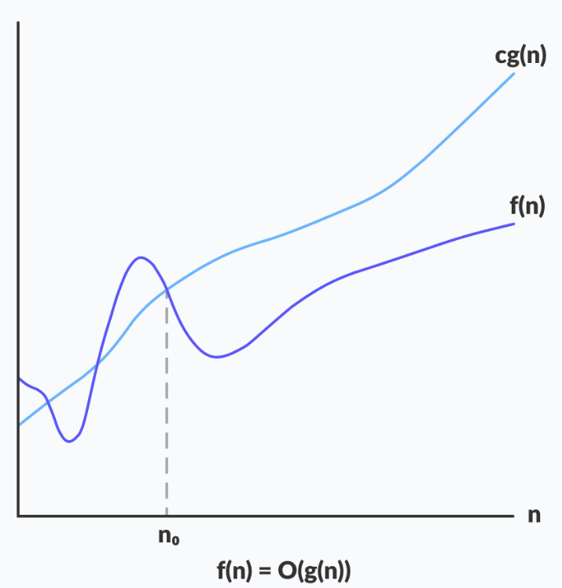
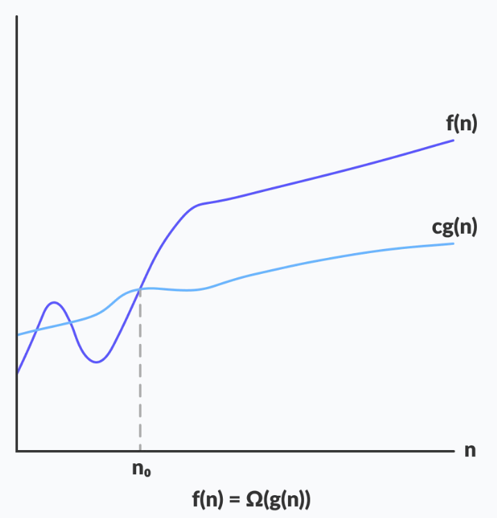
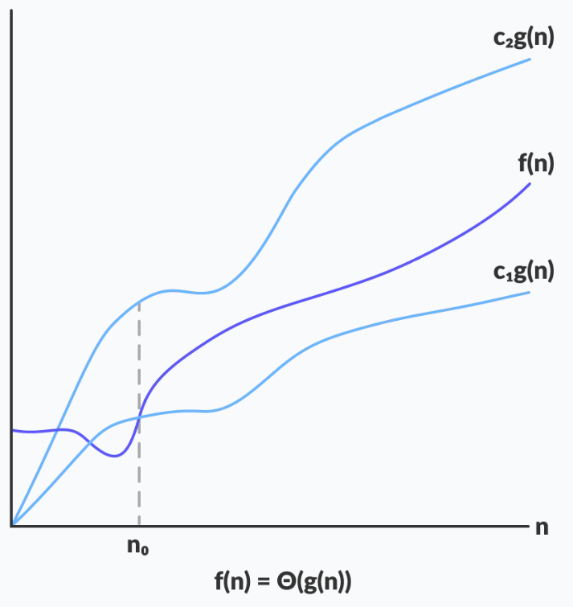
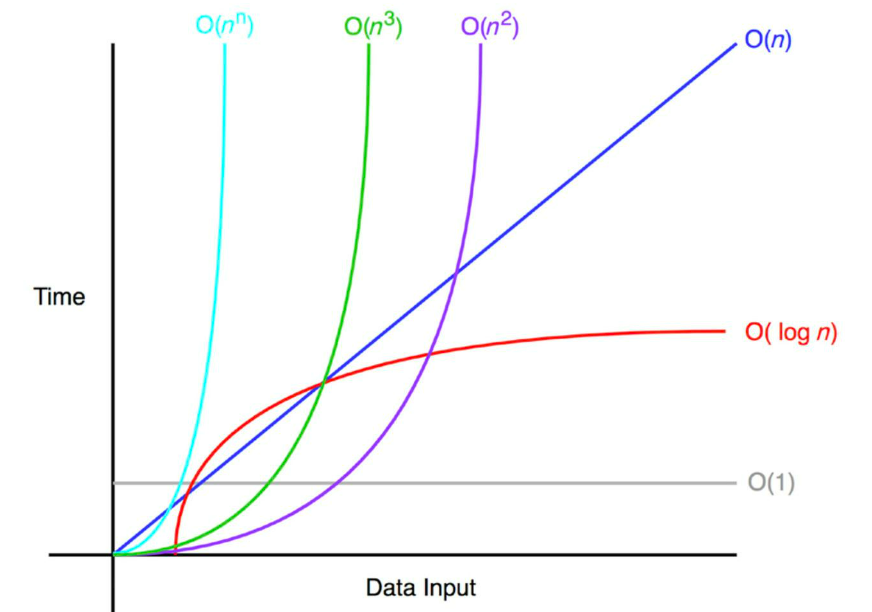

<h1 style="text-align:center;">VJEŽBE 1</h1>

<h2><b>UVOD U PREDMET ALGORITMI I STRUKTURE PODATAKA</b></h2>

Kompjuterski program je kolekcija instrukcija za obavljanje određenog zadatka. Zbog toga, kompjuter mora da čuva podatke, povlači podatke i izvodi razne proračune nad podacima.

Struktura podataka je imenovana lokacija koja se može koristiti za čuvanje i organiziranje podataka. Algoritam je kolekcija koraka za rješavanje određenog problema. Učenje struktura podataka i algoritama dozvoljava nam da pišemo efikasan i optimiziran kompjuterski program.

U ovom predmetu proći ćemo osnovne tipove struktura podataka i algoritama, kao i njihove implementacije koristeći C++.

## <b>Šta je algoritam?</b>

U programiranju algoritam je skup definiranih instrukcija za rješavanje određenog problema. On uzima skup ulaznih parametara/inputa i daje željeni izlaz/output. 

<b>Primjer:</b>

<p style="color: #FF5C5C;">Sabiranje dva broja.</p>

1. Uzmi dva broja kao inpute
2. Saberi brojeve sa +
3. Prikaži rezultat

<p style="color: #FF5C5C">Osobine dobrog algoritma:</p>

1. Input i output su definirani precizno.
2. Svaki korak u algoritmu mora biti jasan i nedvosmislen
3. Odabrani algoritam mora biti najefikasniji između svih raznih načina rješavanja problema
4. Algoritam ne treba sadržavati kompjuterski kod. Umjesto toga, algoritam mora biti napisan na način da ga može koristiti bilo koji programski jezik.

<b>Primjeri:</b>

Algoritam 1. Sabiranje dva broja koja unosi korisnik
```
Korak 1: Start
Korak 2: Deklaracija varijabli broj1, broj2 i suma
Korak 3: Pročitaj vrijednosti broj1 i broj2
Korak 4: Saberi vrijednosti broj1 i broj2 i dodijeli rezultat sumi, suma<-broj1+broj2
Korak 5: Prikaži sumu
Korak 6: Stop
```

Algoritam 2: Pronađi najveći od tri broja
```
Korak 1: Start
Korak 2: Deklaracija varijabli a,b i c
Korak 3: Pročitaj varijable a,b i c
Korak 4: If a > b
            If a > c
                Prikaži: a je najveći broj
            Else
                Prikaži c je najveći broj
         Else
            If b > c
                Prikaži: b je najveći broj
            Else
                Prikaži: c je najveći broj
Korak 5: Stop
```

Algoritam 3: Pronađi kvadratne korijene kvadratne jednačine ax2+bx+c=0

```
Step 1: Start
Step 2: Deklariraj varijable a, b, c, D, x1, x2, rp and ip;
Step 3: Izračunaj diskriminantu
         D ← b2-4ac
Step 4: If D ≥ 0
              r1 ← (-b+√D)/2a
              r2 ← (-b-√D)/2a 
              Prikazi r1 i r2 kao korijene
        Else     
              Izracunaj realni i imaginarni dio
              rp ← -b/2a
              ip ← √(-D)/2a
              Prikazi rp+j(ip) i rp-j(ip) kao korijene
Step 5: Stop
```

Algoritam 4: Pronađi faktorijel broja

```
Korak 1: Start
Korak 2: Deklariraj varijablu n, faktorijel i korak
Korak 3: Inicijaliziraj varijable, faktorijel<-1, korak<-1
Korak 4: Pročitaj vrijednost od n
Korak 5: Ponavljaj korake do korak = n
    Korak 5.1: faktorijel <- faktorijel*korak
    Korak 5.2: korak <- korak +1
Korak 6: Prikaži faktorijel
Korak 7: Stop
```

Algoritam 5: Pronađi da li je broj prost ili ne

```
Korak 1: Start
Korak 2: Deklariraj varijable n, i i flag
Korak 3: Inicijaliziraj varijable, flag<-1, i<-2
Korak 4: Pročitaj n od korisnika
Korak 5: Ponavljaj korake do i=(n/2)
    Korak 5.1: If (n%i) jednako nula
                flag <-0
                Idi na korak 6
    Korak 5.2: i<-i+1
Korak 6: If flag = 0
            Prikaži: n nije prost
         Else
            Prikaži: n je prost
Korak 7: Stop
```

Algoritam 6: Pronađi Fibonacijev niz do 1000

```
Korak 1: Start
Korak 2: Deklariraj varijable prvi_clan, drugi_clan
Korak 3: Inicijaliziraj varijable prvi_clan <- 1, drugi clan <- 0
Korak 4: Prikazi prvi_clan i drugi_clan
Korak 5: Ponavljaj do drugi_clan <=1000
    Korak 5.1: temp <- drugi_clan
    Korak 5.2: drugi_clan <- drugi_clan + prvi_clan
    Korak 5.3: prvi_clan <- temp
    Korak 5.4: Prikaži: drugi_clan
Korak 6: Stop
```

## <b>Strukture podataka i Tipovi</b>

Strukture podataka su spremnici koji se koriste za čuvanje i organiziranje podataka. To je način organiziranja podataka na kompjuteru za efikasno pristupanje i mijenjanje. 

Zavisno od potreba projekta, važno je odabrati odgovarajuće strukture pdoataka.

Naprimjer, ako želimo podatke čuvati sekvencijalno u memoriji, onda koristimo Niz kao strukturu podataka.

Strukture podataka i tipovi podataka nisu isto. Strukture podataka su kolekcije tipova podataka organizirane u određenom smislu.

<b>Tipovi struktura podatak:</b>
<p style="color: #5C5CFF;">1. Linearni</p>
<p style="color: #5C5CFF;">2. Nelinearni</p>

### Linearne strukture podataka

U linearnim strukturama podataka, elementi su poredani u sekvencu jedan iza drugog. Obzirom da su elementi poredani u određenom redoslijedu, ovaj tip podataka je jednostavan za implementirati. Kako kompleksnost programa raste, linearna struktura podataka nije najbolji izbor zbog operacijski kompleksnosti.

### <b>Primjeri linearnih struktura podataka su:</b>

<p style="color: #5C5CFF;">1. NIZ/ARRAY</p>

Niz je kolekcija elemenata iste vrste smještenih na kontinuiranim memorijskim lokacijama na koje se može pojedinačno referencirati korištenjem indeksa prema jedinstvenom identifikatoru/indeksu.

<div style="text-align:center;"></div>

<p style="color: #5C5CFF;">2. STOG/STACK</p>

U strukturi podataka stek/stog, elementi su pohranjeni po LIFO principu. Odnosno, prvi će biti uklonjen posljednji element pohranjen u stogu. 

<div style="text-align:center;"></div>


<p style="color: #5C5CFF;">3. RED/QUEUE</p>

Za razliku steka, struktura reda radi na principu FIFO. Odnosno, prvi element spremljen u red će biti uklonjen prvi.

<div style="text-align:center;"></div>


<p style="color: #5C5CFF;">4. LISTE</p>

U strukturi podataka povezane liste, elementi liste su povezani kroz seriju čvorova. A svaki čvor sadrži svoje podatke i adresu do sljedećeg čvora. 

<div style="text-align:center;"></div>

### <b>Primjeri nelinearnih struktura podataka su:</b>

Za razliku od linearnih struktura podataka, elementi u nelinearnoj strukturi podataka nisu u nikakvoj sekvenci. Oni su povezani u hijerarhijskom smislu gdje je jedan element spojen sa jednim ili više elemenata.

Dalje se dijele na graf i stablo strukture podataka.

<p style="color: #5C5CFF;">1. Graf strukture podataka</p>

U graf strukturi podataka svaki čvor se naziva vrh i svaki vrh je spojen sa drugih vrhovima kroz rubove.

<div style="text-align:center;"></div>

Primjeri struktura podataka baziranih na grafovima su:
1. Razapinjujuce stablo
2. Matrica susjedstva
3. Lista susjedstva

<p style="color: #5C5CFF;">2. Stablo strukture podataka</p>

Stablo, kao i graf, je kolekcija vrhova i rubova, ali kod stabla može biti samo jedan rub između dva vrha.

<div style="text-align:center;"></div>

Primjeri struktura podataka baziranih na principu stabla su:
1. Binarno stablo
2. Binarno stablo pretraživanja
3. AVL stablo
4. B stablo
5. B+ stablo
6. Red-Black stablo

### <b> LINEARNA VS NELINEARNA STRUKTURA PODATAKA </b>

<table style="background: gray;color: black;">
<tr>
<th>LINEARNA STRUKTURA</th>
<th>NELINEARNA STRUKTURA</th>
</tr>
<tr>
<td>Elementi su u sekvencijalnom redu</td>
<td>Elementi su nesekvencijalnom redu/hijerarhiji</td>
</tr>
<tr>
<td>Svi elementi su prezentirani u jednom sloju</td>
<td>Elementi su prezentirani u različitim slojevima</td>
</tr>
<tr>
<td>Elementi se mogu preći u jednom run-u</td>
<td>Zahtjevaju više run-ova</td>
</tr>
<tr>
<td>Nisu optimalni za memoriju</td>
<td>Optimalniji za memoriju</td>
</tr>
<tr>
<td>Vremenska kompleksnost raste sa rastom uzorka</td>
<td>Vremenska kompleksnost ostaje ista</td>
</tr>
</table>

Znanje o raznim strukturama podataka, pomaže da bolje razumijemo svaku strukturu i da možemo iskoristiti najbolje rješenje za svoj projekt. Odnosno, na taj način pišemo memorijski i vremenski efikasne kodove.

### <b>VAŽNOST STRUKTURA PODATAKA</b>

Recimo da želimo napisati program koji riješava problem pronalaska sume prvih 10^11 prirodnih brojeva.

Recimo da smo napisali sljedeći algoritam:

```
Korak 1: Start
Korak 2: Inicijalizacija suma = 0
Korak 3: Za svaki prirodni broj u rasponu od 1 do 10^11(uključeno)
            suma = suma + n
Korak 4: Ispiši suma
Korak 5: End
```

Implementacija istog u C++ bi bila:

```

int findSum() {
    int suma = 0;
    for (int i = 1; 100000000000; i++){
        suma += i;
    }
    return suma;
}

```

E sad ako pokrenemo ovaj kod njeno izvršavanje će trajati jako dugo. Dva najvažnija resursa kompjuterskog programa su vrijeme i memorija:

```
Vrijeme_izvrsavanja = broj_instrukcija * vrijeme_instrukcije.
```

U ovom slučaju:

```x = 1 + (10^11 + 1) + (10^11) + 1, što je x = 2 * 10^11 + 3```

Pretpostavimo da kompjuter može izvršiti 108 instrukcija u jednoj sekundi, vrijeme bi onda bilo oko 33 minute.

Dakle moramo optimizovati kod da ne čekamo 33 minute na njegovo izvršavanje. 

Formula za računanje sume prvih N prirodnih brojeva je:

``` suma = N*(N+1)/2```.

Odnosno u kodu bi to bilo:

```
int findSum(N) {
    return N * (N + 1) / 2;
}
```

Ovaj kod se izvrši u samo jednoj instrukciji i odradi zadatak neovisno o zadanoj vrijednosti. Vrijeme za izvršavanje ovog koda je dakle ```1/y```.

SKALABILNOST I PROBLEM MEMORIJE

## <b>ASIMPTOTSKA NOTACIJA - VELIKO O</b>

Efikasnost algoritma zavisi od vremena, prostora i drugih resursa bitnih za izvršavanje algoritma. Efikasnost se mjeri uz pomoć asimptotske notacije.

Algoritmi nemaju iste performanse za različite inpute. Sa povećanjem inputa mijenja se performansa. Analiza promjena u performansama algoritma sa promjenom ulaznih veličina je definirano asimptotskom analizom.

### <b>ASIMPTOTSKA NOTACIJA</b>
Asimptotska notacija je matematička notacija korištena za opisivanje vremena izvršavanja algoritma kad inputi teže nekoj specifičnoj vrijednosti ili limitirajućoj vrijednosti.

Npr. Kod bubble sorta kad je ulazni niz već sortiran, vrijeme algoritma je linearno (najbolji slučaj). Ali, kad je niz obrnuto poredan, algoritam ima maksimalno vrijeme (kvadratno) da sortira elemente (najgori slučaj).

Kad nije sortiran ili u obrnutom redu, onda ima prosječno vrijeme. Ove dužine trajanja se označavaju asimptotskom notacijom.

Postoje tri različite notacije:
<p style="color: #5C5CFF;">1. BIG-O NOTACIJA</p>
<p style="color: #5C5CFF;">2. OMEGA NOTACIJA</p>
<p style="color: #5C5CFF;">3. THETA NOTACIJA</p>

### <b>VELIKO-O NOTACIJA (O-NOTACIJA)</b>

Ova notacija predstavlja gornju granicu vremena izvršavanja algoritma. Odnosno, daje najgori slučaj kompleksnosti algoritma.

<div style="text-align:center;"></div>

```
O(g(n)) = { f(n): there exist positive constants c and n0
            such that 0 ≤ f(n) ≤ cg(n) for all n ≥ n0 }
```

Gornji izraz može se opisati kao funkcija f(n) pripada setu O(g(n)) ako postoji pozitivna konstanta c takva da leži između 0 i cg(n) za dovoljno veliko n.

Za svaku vrijednost n, vrijeme izvršavanja algoritama ne prolazi vrijeme obezbijeđeno sa O(g(n)).

Obzirom da daje najgori slučaj vremena, široko se koristi jer smo uvijek zainteresirani za najgori slučaj.

### <b>OMEGA NOTACIJA</b>

Omega notacija predstavlja donju granicu vremena izvršavanja algoritma. Odnosno prikazuje najbolji slučaj kompleksnosti.

<div style="text-align:center;"></div>

```
Ω(g(n)) = { f(n): there exist positive constants c and n0 
            such that 0 ≤ cg(n) ≤ f(n) for all n ≥ n0 }
```

Gornji izraz se može opisati kao funkcija f(n) pripada setu Ω(g(n)) ako postoji pozitivna konstanta c takva da leži iznad cg(n) za dovoljno veliko n.

Za svaku vrijednost od n, minimalno vrijeme algoritma je dato sa Omega Ω(g(n)).

### <b>THETA NOTACIJA</b>

Theta notacija zatvara funkciju odozgo i odozdo. Obzirom da predstavlja gornju i donju granicu vremena izvršavanja algoritma, koristi se za analizu prosječnog slučaja kompleksnosti algoritma.

<div style="text-align:center;"></div>

Za funkciju g(n),  Θ(g(n)) je dato relacijom:
```
Θ(g(n)) = { f(n): there exist positive constants c1, c2 and n0
            such that 0 ≤ c1g(n) ≤ f(n) ≤ c2g(n) for all n ≥ n0 }
```

Gornji izraz se može opisati kao funkcija f(n) pripada setu Θ(g(n)) ako postoji pozitivna konstanta c1 i c2 takve da se mogu "stisnusti" između c1g(n) i c2g(n), za dovoljno veliko n.

Ako funkcija f(n) leži bilo gdje između c1g(n) i c2g(n) za svako n ≥ n0, onda kažemo da je f(n) asimptotski čvrsto vezana.

<div style="text-align:center;"></div>

## Primjeri računanja Big-O

Primjer 1. O(1)

```
void printFirstElementOfArray(int arr[])
{
    printf("First element of array = %d",arr[0]);
}
```

Primjer 2. O(n)

```
void printAllElementOfArray(int arr[], int size)
{
    for (int i = 0; i < size; i++)
    {
        printf("%d\n", arr[i]);
    }
}
```

Primjer 3. O(n^2)
```
void printAllPossibleOrderedPairs(int arr[], int size)
{
    for (int i = 0; i < size; i++)
    {
        for (int j = 0; j < size; j++)
        {
            printf("%d = %d\n", arr[i], arr[j]);
        }
     }
}
```js

