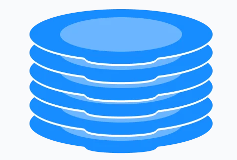
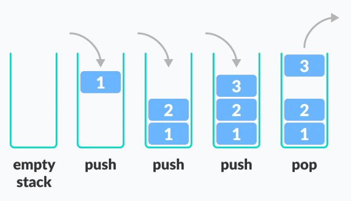
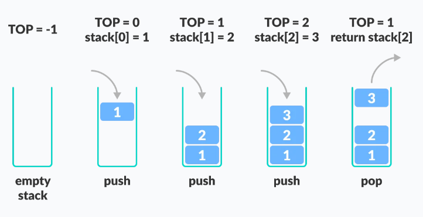

# STEK

Stek je linearna struktura podataka koja prati princip LIFO (Last In First Out). Ovo znači da elementi koji su prvi dodani u stack, uklanjaju se prvi.

Primjer: Tanjiri.

U ovoj strukturi možemo dodati novi "tanjir" na vrh ili ukloniti "tanjir" sa vrha. Ako želimo tanjir na dnu, moramo prvo ukloniti sve tanjire sa vrha. 

## LIFO PRINCIP STEKA

Dodavanje elementa na vrh steka se naziva PUSH, a uklanjanje elementa se naziva POP.

Osnovne operacije nad stekom su:

* PUSH - Dodavanje elementa na vrh steka
* POP - Uklanjanje elementa sa vrha steka
* ISEMPTY - Provjera je li stek prazan
* ISFULL - Provjera je li stek pun
* PEEK - Dobijanje vrijednosti elementa sa vrha bez njegovog uklanjanja

Pokazivač TOP se koristi za praćenje informacija o top elementu u steku.

Kad se inicijalizira stek, vrijednost top-a se postavi na -1 tako da možemo provjeriti da li je stek prazan komparirajući TOP == -1.

Na dodavanje/push elementa povećava vrijednost TOP-a i smještamo novi element u poziciju na koju pokazuje TOP.

Na pop elementa, vraćamo elemt na koji TOP pokazuje i smanjujemo njegovu vrijednost.

Prije push treba provjeriti da li je stack već pun. Prije pop-a treba provjeriti da li je stack već prazan.

Funkcije pop() i push() su O(1). 

Funkcija print je O(n).

Funkcije isEmpty i isFull su O(1).

## Primjena Stack Strukture podataka

Najčešće primjene su: Obrnuti riječ - staviti slova u stack i izbacivati ih(pop). Zbog LIFO reda, dobijemo riječi u obrnuto redoslijedu.

U browserima - back dugme čuva sve URL-ove koje smo posjetili i izbacuje uvijek zadnji.

