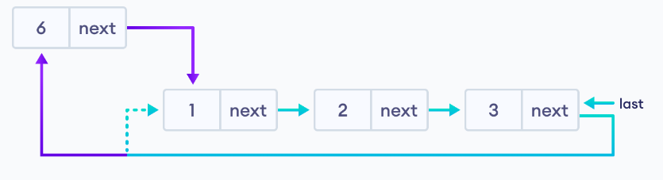
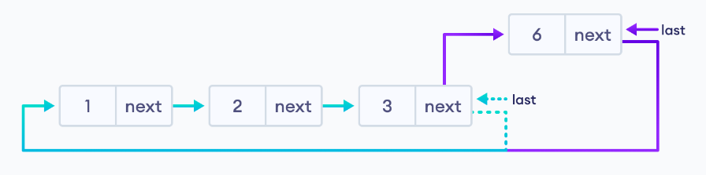
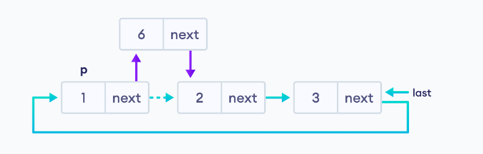
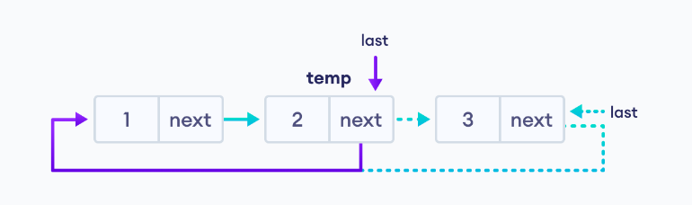
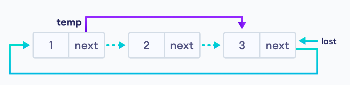

# KRUŽNA LISTA


Kružna povezana lista je varijacija povezane liste u kojoj je zadnji element povezan sa prvim elementom. Ova forma daje kružnu petlju.

Kružne povezane liste mogu biti jednostruko ili dvostruko povezane.

Kod jednostruko povezane, sljedeći pokazivač zadnjeg čvora pokazuje na prvi čvor.


U dvostrukoj, prethodni pokazivač prvog čvora pokazuje na zadnji čvor.


Jednostavnu implementaciju kružne liste moguće je vidjeti na primjeru ```circularlistexample1.cpp```.

## Operacije sa kružnom listom:

Dodavanje na početak



Dodavanje na kraj



Dodavanje na poziciju



Brisanje čvorova:

Ako je jedini element

Ako je element koji se briše jedini čvor. Oslobodi se memorija okupirana od čvora i spremi se NULL za zadnji.

Brisanje sa kraja



Brisanje sa pozicije



Vremenska kompleksnost dodavanja elemenata je O(1) ili O(n). Brisanja je O(1). Prostorna kompleksnost je O(1) za dodavanje i brisanje.

Kod kružnih lista ne treba dodjeljivanje NULL vrijednosti jer čvor uvijek pokazuje na sljedeći. Početna tačka može biti bilo koji čvor. Prolazak od prvog do zadnjeg čvora je brz.

Primjenjuju se u multiplayer igricama za dodjelu igrača. Razne aplikacije u OS sistemu mogu se spremiti u kružnu listu gdje OS vrši iteraciju kroz ove aplikacije.