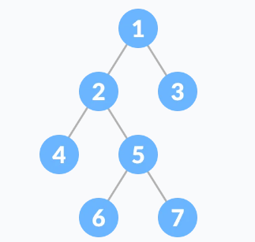

# PUNO BINARNO STABLO

Puno binarno stablo je specijalan tip binarnog stabla u kojem svaki roditeljski čvor ima ili dvoje ili nijedno dijete.

## Teoreme punog binarnog stabla:

Neka je 
i = broj interni čvorova, n = ukupni broj čvorova, l = broj listova, $\lambda$ = broj nivoa.

Ukupni broj listova je i+1

Broj internih čvorova je (n-1)/2

Broj listova je (n+1)/2

Ukupan broj čvorova je 2l-1

Ukupan broj internih čvorova je l-1

Najveći broj listova je 2$\lambda$ -1