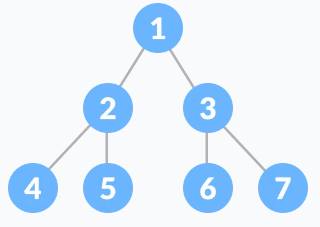
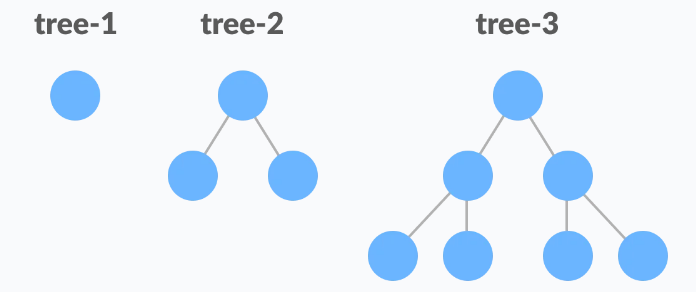

# Savršeno binarno stablo

Savršeno binarno stablo je tip binarnog stabla u kojem svaki interni čvor ima tačno dvoje djece i svi listovi su na istom levelu.

Svi interni čvorovi imaju stepen 2.

Rekurzivno, savršeno binarno stablo se može definirati sa:

Ako nijedan čvor nema djece, radi se o savršenom binarnom stablu visine h=0. Ako je h>0 onda se radi o savršenom binarnom stablu ako oba njegova podstabla su visine h-1 i ne preklapaju se.

