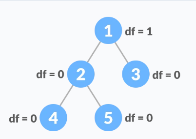

# Binarno stablo pretrage

Balansirano binarno stablo je definirano kao binarno stablo u kojem se visina lijevog i desnog podstabla svakog čvora ne razlikuje više od 1.

Uslovi za balansirano binarno stablo su:

Razlika između lijevog i desnog podstabla za bilo koji čvor nije veća od 1

Lijevo podstablo je balansirano

Desno podstablo je balansirano

