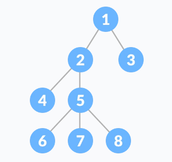
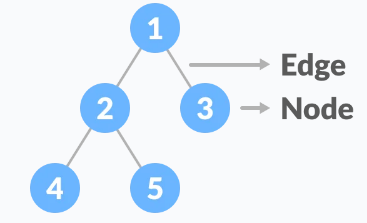
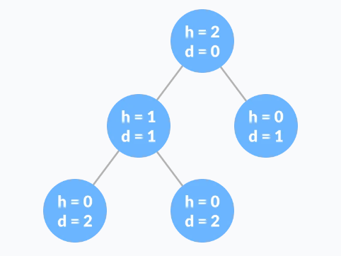

# STABLA

Stablo je nelinearna hijerahijska struktura podataka koja se sastoji od čvorova povezanih rubovima.

Druge strukture podataka kao što su nizovi, povezane liste, stek i red su linearne strukture podataka koje čuvaju podatke sekvencijalno. U svrhu obavljanja bilo koje operacije u linearnoj strukturi podataka, vremenska kompleksnost se povećava sa porastom veličine podataka.

Različiti oblici stabla kao struktura podataka omogućavaju brže i lakše načine za pristup podacima, obzirom da se radi o nelinarnoj strukturi podataka.

## TERMINOLOGIJA

Čvor/Node - entitet koji sadrži ključ ili vrijednost i pokazivač na čvorove djece/child

Zadnji čvor/Leaf/External Node svake putanje se naziva čvor list ili eksterni čvor koji nema pokazivača na dječije čovorove.

Internal Node - čvor koji ima barem jedno dijete se naziva interni čvor.

Rub/Edge - je veza između bilo koja dva čvora

Korijen/Root - je najviši čvor drveta

Visina čvora je broj rubova od čvora do najnižeg lista (najduži put od čvora do lista)

Dubina čvora - je broj rubova od korijena do čvora.

Visina drveta - je visina čvora korijena ili dubina najdubljeg čvora.

Stepen čvora - je ukupni broj grana tog čvora.

Šuma - je kolekcija odvojenih drveća.

## Tipovi stabla:

* Binarno stablo
* Binarnos stablo pretrage
* AVL stablo
* B stablo

## Primjena stabla

Binarno stablo pretrage (BST) se koristi za brze provjere da li se element nalazi u setu.

Heap je vrsta stabla koje se koristi za Heap Sort.

Modificirana verzija stabla naziva Tries se koristi u modernim ruterima za spremanje informacija o rutama.

Najpopularnije baze podataka koriste B i T stabla za spremanje podataka.

Kompajleri koriste sintaksu stabla za validiranje sintakse svakog programa koji pišemo.

