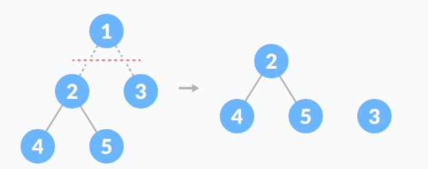
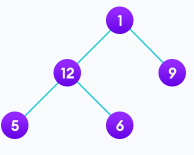
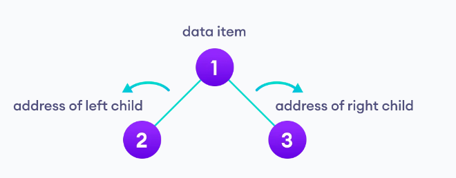
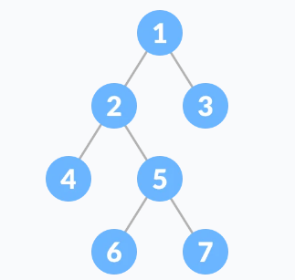
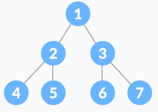
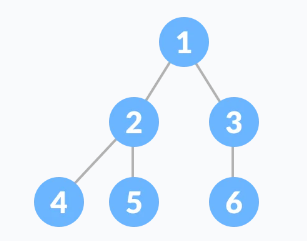
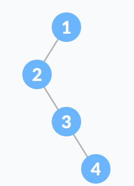
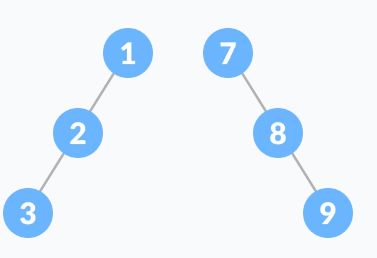
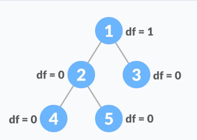

# STABLA

Stablo je nelinearna hijerahijska struktura podataka koja se sastoji od čvorova povezanih rubovima.


Druge strukture podataka kao što su nizovi, povezane liste, stek i red su linearne strukture podataka koje čuvaju podatke sekvencijalno. U svrhu obavljanja bilo koje operacije u linearnoj strukturi podataka, vremenska kompleksnost se povećava sa porastom veličine podataka.

Različiti oblici stabla kao struktura podataka omogućavaju brže i lakše načine za pristup podacima, obzirom da se radi o nelinarnoj strukturi podataka.

## TERMINOLOGIJA

Čvor/Node - entitet koji sadrži ključ ili vrijednost i pokazivač na čvorove djece/child

Zadnji čvor/Leaf/External Node svake putanje se naziva čvor list ili eksterni čvor koji nema pokazivača na dječije čovorove.

Internal Node - čvor koji ima barem jedno dijete se naziva interni čvor.

Rub/Edge - je veza između bilo koja dva čvora


Korijen/Root - je najviši čvor drveta

Visina čvora je broj rubova od čvora do najnižeg lista (najduži put od čvora do lista)

Dubina čvora - je broj rubova od korijena do čvora.

Visina drveta - je visina čvora korijena ili dubina najdubljeg čvora.


Stepen čvora - je ukupni broj grana tog čvora.

Šuma - je kolekcija odvojenih drveća.



## Tipovi stabla:

* Binarno stablo
* Binarnos stablo pretrage
* AVL stablo
* B stablo

## Primjena stabla

Binarno stablo pretrage (BST) se koristi za brze provjere da li se element nalazi u setu.

Heap je vrsta stabla koje se koristi za Heap Sort.

Modificirana verzija stabla naziva Tries se koristi u modernim ruterima za spremanje informacija o rutama.

Najpopularnije baze podataka koriste B i T stabla za spremanje podataka.

Kompajleri koriste sintaksu stabla za validiranje sintakse svakog programa koji pišemo.

## Prolazak kroz stablo

Prolazak kroz stablo (Traversing) znači posjetiti svaki čvor u stablu. Možemo npr. dodati sve vrijednosti u stablo ili pronaći najveći čvor. Za sve ove operacije, potrebno je posjetiti svaki čvor stabla.



Na osnovu prethodne slike, moguće je pročitati elementa stabla na sljedeće načine:

```1->12->5->6->9``` ili npr. ```5->6->12->9->1```.

Međutim prilikom prolaska kroz stablo potrebno je koristiti metode koje uzimaju u obzir osnovnu strukturu stabla.

```c++
struct node {
    int data;
    struct node* left;
    struct node* right;
}
```

Struktura čvor koja pokazuje na left i right može imati i svoju djecu tako da na njih posmatramo kao podstabla, a ne kao podčvorove.

Na osnovu ove strukture svako stablo je kombinacija:

* čvora koji nosi podatak
* dva podstabla

Naš cilj je posjetiti svaki čvor, tako da trebamo proći kod sve čvorove i u podstablu.

Zavisno od reda kojim to radimo razlikujemo tri tipa prolaska kroz stabla.

### Inorder traversal

Prvo posjetimo sve čvorove u lijevom podstablu, zatim korijen i onda sve čvorove u desnom podstablu.

```
inorder(root->left)
display(root->data)
inorder(root->right)
```

### Preorder traversal

Prvo posjetimo korijen, zatim lijevo, a onda desno podstablo.

```
display(root->data)
preorder(root->left)
preorder(root->right)
```

### Postorder traversal

Posjetimo sve čvorove u lijevom podstablu, zatim u desnom podstablu i onda korijen.

```
postorder(root->left)
postorder(root->right)
display(root->data)
```

# BINARNO STABLO

Binarno stablo je stablo struktura podataka kod koje svaki roditeljski čvor ima najviše dvoje djece. Svaki čvor binarnog stabla se sastoji od tri stvari:

* podatka koji nosi
* adrese lijevog djeteta
* adrese desnog djeteta



## Tipovi binarnog stabla

Razlikujemo sljedeće tipove binarnog stabla:

Puno binarno stablo - specijalna kategorija binarnog stabla kod kojeg svaki roditeljski čvor ima ili dvoje ili nijedno dijete.




Savršeno binarno stablo - je kategorija binarnog stabla u kojoj svaki interni čvor ima tačno dvoje djece i svaki list čvor je na istom nivou.



Kompletno binarno stablo je kao puno binarno stablo, ali sa dvije razlike:

svi listovi moraju naginjati prema lijevo
zadnji list element ne smije imati desnog brata



Degenerativno stablo - je stablo koje ima samo jedno dijete, lijevo ili desno.



Iskrivljeno binarno stablo - je degenerativno stablo kod kojeg dominira ili lijevi listovi ili desni. Tako da postoje lijevo iskrivljeno stablo i desno iskrivljeno stablo.



Balansirano binarno stablo je tip binarnog stabla u kojeg je razlika između visine lijevog i desnog podstabla za svaki čvor je ili 0 ili 1.

