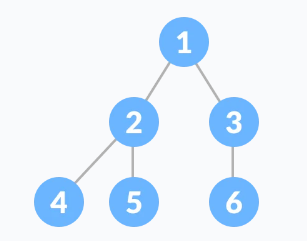

# Kompletno binarno stablo

Kompletno binarno stablo je stablo u kojeg su svi leveli potpuno popunjeni, osim zadnjeg, koje je popunjeno na lijevoj strani.

Kompletno binarno stablo je kao puno binarno stablo sa dvije bitne razlike:

Svi listovi moraju naginjati lijevo. Zadnji list element ne mora imati desnog brata.

