# HEAP 

Heap struktura podataka je kompletno binarno stablo koje zadovoljava heap osobine gdje je:

* svaki čvor je uvijek veći od svoje djece. ključ korijena je isto najveći od svih ostalih ključeva - to se naziva max heap property

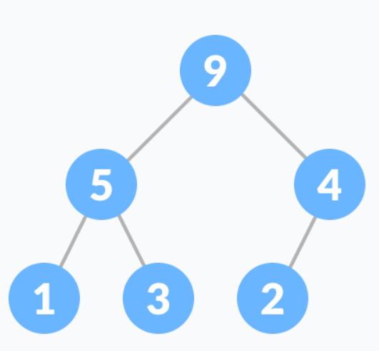

* svaki čvor je uvijek manji od svoje djece i ključ korijena je najmanji od svih ostalih ključeva - to se naziva min heap property

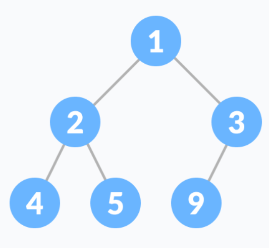

## Heap operacije

### Heapify
Heapify je proces kreiranje heap strukture podataka iz binarnog stabla. Koristi se za kreiranje Min-Heap ili Max-Heap.

Neka je zadan ulazni niz:

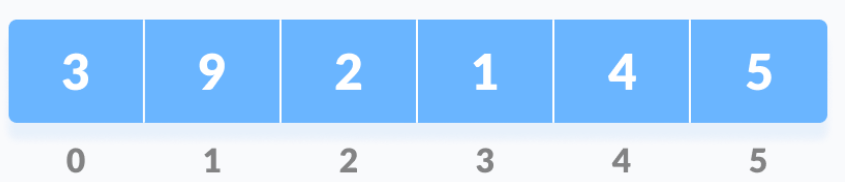

Kreiramo binarno stablo iz niza:

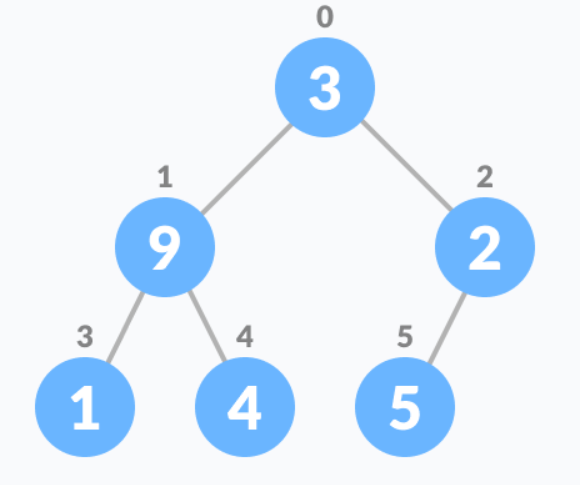

Startamo od prvog indeksa koji nije list čvor i čiji je indeks dat sa n/2 - 1.

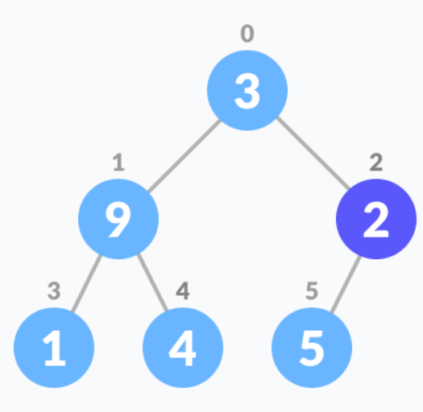

Postavimo trenutni element i kao najveći.

Indeks lijevog djeteta je dat sa 2i+1, a desnog djeteta je dat sa 2i+2.

Ako je lijevo dijete veće od trenutnog elementa (elementa na i-tom indeksu), postavljamo indeks lijevog djeteta kao najveći.

Ako je desno dijete veće od od elementa spremljenog kao najveći, postavljamo indeks desnog djeteta kao najveći.

Zamjeni najveći sa trenutnim elementom.

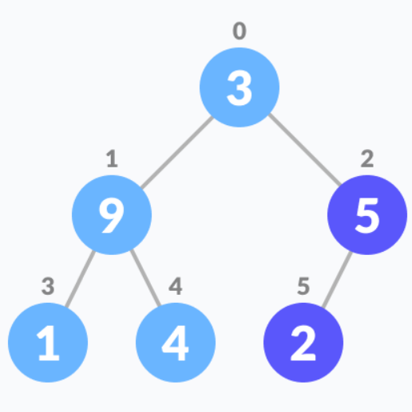

Ponavljaj korake 3-7 dok se sva podstabla ne heapifiraju.

```
Heapify(array, size, i)
  set i as largest
  leftChild = 2i + 1
  rightChild = 2i + 2
  
  if leftChild > array[largest]
    set leftChildIndex as largest
  if rightChild > array[largest]
    set rightChildIndex as largest

  swap array[i] and array[largest]
```

Za kreiranje Max-Heap-a.
```
MaxHeap(array, size)
  loop from the first index of non-leaf node down to zero
    call heapify
```

Za Min-heap, oboje i lijevo dijete i desno dijete moraju biti veće od roditelja za sve čvorove.

### Dodavanje elementa u Heap

Algoritam

```
If there is no node, 
  create a newNode.
else (a node is already present)
  insert the newNode at the end (last node from left to right.)
  
heapify the array
```

Dodaj novi element na kraj stabla.

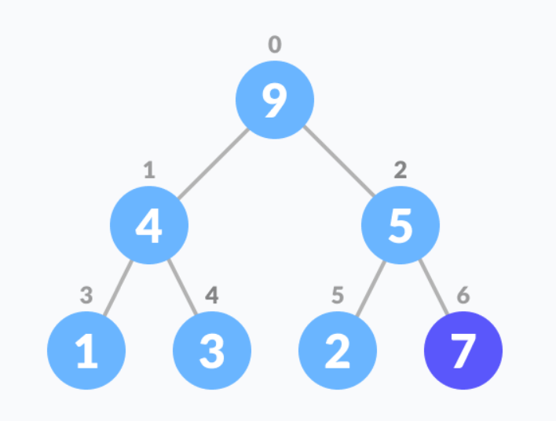

Heapify stablo.

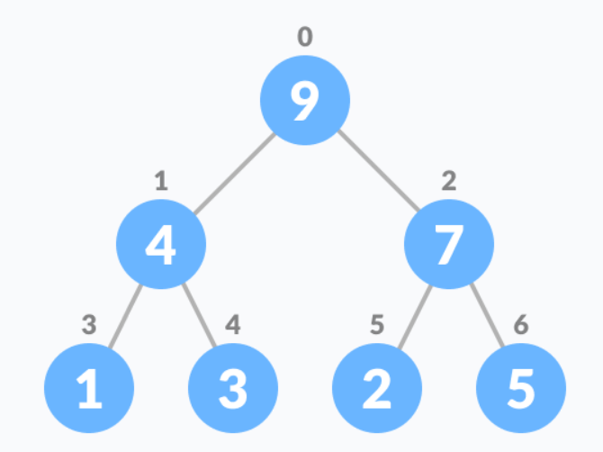

Prethodno je za Max Heap. Za Min-Heap gornji algoritam je moficiran tako da roditeljski čvor je uvijek manji od novog čvora.

### Brisanje elemenata iz Heap-a

Algoritam

```
If nodeToBeDeleted is the leafNode
  remove the node
Else swap nodeToBeDeleted with the lastLeafNode
  remove noteToBeDeleted
   
heapify the array
```

Odaberite element za brisanje.

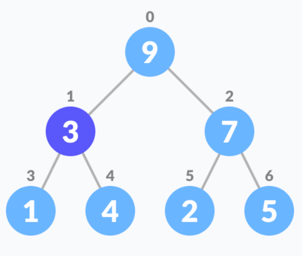

Zamjeni ga sa zadnjim elementom.

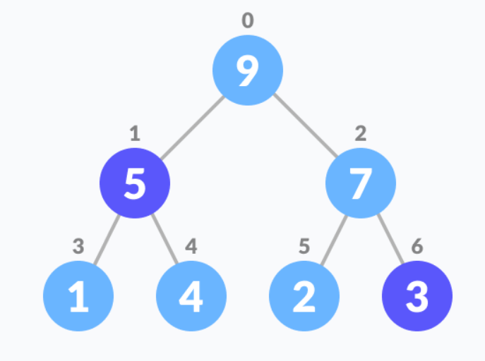

Ukloni zadnji element.

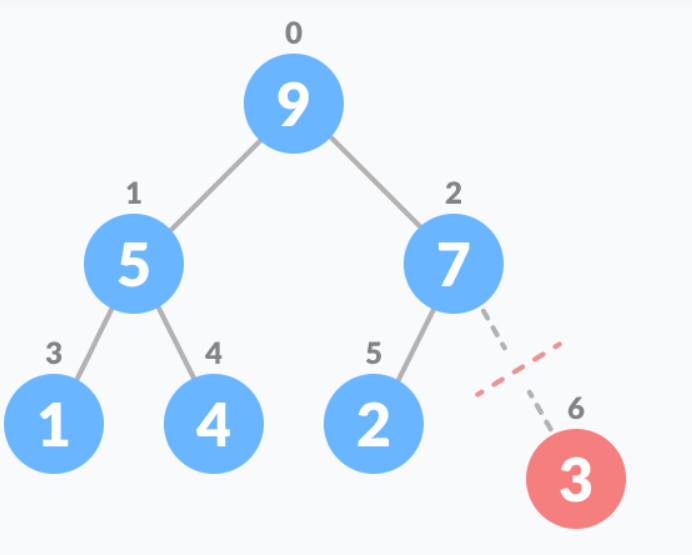

Heapify stablo.

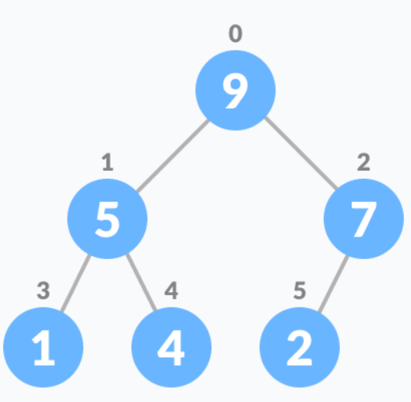

Za Min Heap, gornji algoritam se modificira tako da su oba čvora djece manja od trenutnog čvora.

### PEEK (PRONAĐI MAX/MIN)

Peek operacije vraćaju max iz Max Heap-a tj minimum iz Min Heap-a bez brisanja čvora.

Peek (Find max/min)
Peek operation returns the maximum element from Max Heap or minimum element from Min Heap without deleting the node.

```
return rootNode
```

### EKSTRAKCIJA MAX/MIN

Extract Max vraća čvor sa maksimalnom vrijednošću nakon što ga uklanja iz Max Heap-a.

Extract Min vraća čvor sa minimalnom vrijednošću nakon što ga ukloni iz Min Heapa-a.

## PRIMJENA HEAP-A

Heap se koristi za implementaciju prioritetnog reda.

Dijkstra algoritmu

Heap sortu


