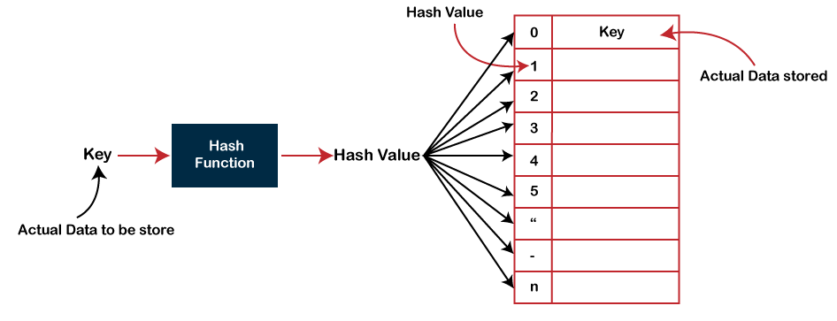
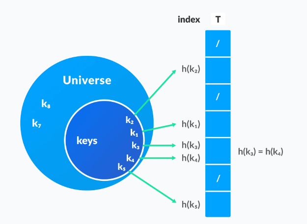
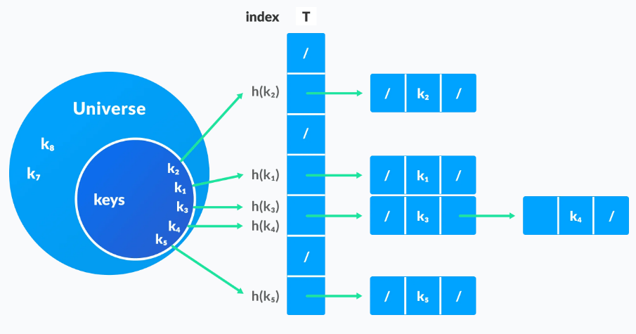

# HASH TABELE

Hash tabela je je struktura podataka koja sprema elemente u ključ-vrijednost parove gdje je:

Ključ - jedinstven integer koji se koristi za indeksiranje vrijednosti

Vrijednost - podaci vezani za ključeve

## HEŠIRANJE

U hash tabelu, novi indeks se kreira koristeći ključeve. Element koji odgovara tom ključu je spremljen na taj indeks. Taj proces se naziva heširanje.

Neka je k ključ, a h(x) hash funkcija.

h(k) će dati novi indeks za spremiti element vezan sa k.

Heširanje je tehnika koja mapira veliki set proizvoljnih podataka u tabelarne indekse koristeći hash funkcije. 

Omogućuje pregled, update i povlačenje podataka u O(1).

Nakon spremanja velikog broja podataka, potrebno je raditi razne operacije nad tim podacima. Pregled informacija je sigurno obavezna operacija nad setom podataka. Linearna pretraga i binarna pretraga rade pregled/search sa O(n) i O(logn) respektivno. Kako veličina seta podataka raste, ova kompleksnost postaje veća što nije prihvatljivo.

Dakle, trebamo tehniku koja ne ovisi od veličine podataka. Heširanje omogućuje pregled u konstantnom vremenu O(1).

Heš funkcija se koristi za mapiranje svakog elementa seta podataka u indekse tabele.

## KOLIZIJA

Kada heš funkcija generiše isti indeks za više ključeva, dolazi do konflikta (ne znamo šta spremiti na taj indeks). To se naziva heš kolizija.

Ovo se uklanja sa nekim od sljedećih tehnika:

### Ulančavanje 

U ulančavanju, ako heš funkcija proizvede isti indeks za različite elemente, ovi elementi se spremaju u isti indeks ali koristeći povezanu listu. Ako je j slot za više elemenata, sadrži pokazivač na glavu liste tih elemenata. Ako nema elemenata, j je NULL.

### Otvoreno adresiranje

Za razliku od ulančavanja, otvoreno adresiranje ne sprema više elemenata u isti slot. Ovdje, svaki slot je ili popunjen sa jednim ključem ili ostavljen NULL.

Tehnike u otvorenom adresiranju su:

* Linearno sondiranje - u linarnom sondiranju, kolizija se riješava sa provjerom narednog slota. Npr. ako se kolizija desi na poziciji h(k, 0), onda se provjerava h(k, 1). Linearno povećava pozicije od i dok se ne nađe prazan slot. Problem sa linearnim sondiranjem je da moramo prolaziti kroz cijeli cluster.

* Kvadratno sondiranje - radi slično linearnom sondiranju, ali se razmak između slotova povećava.
  
* Duplo heširanje - ako se desi kolizija nakon primjene heš funkcije, onda se računa nova heš funkcija za pronalazk sljedećeg slota.

## PRIMJENA HEŠ TABELA

* Kad je potrebna konstantno vrijeme za pretragu i insert
* Kriptografskim aplikacijama
* Kad je potrebno indeksiranje podataka